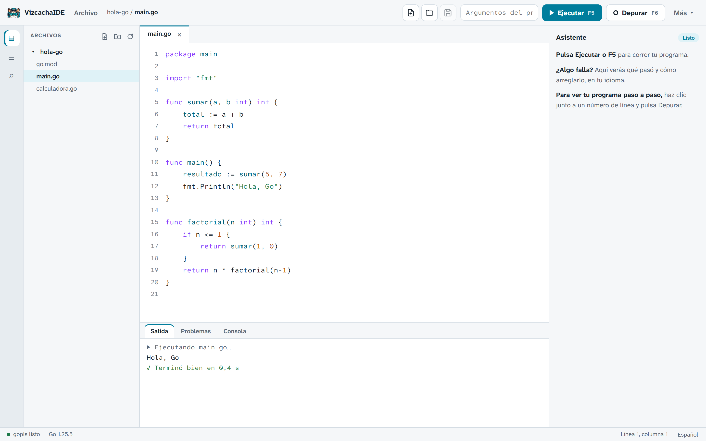
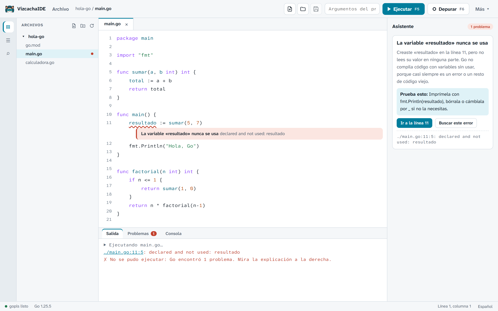
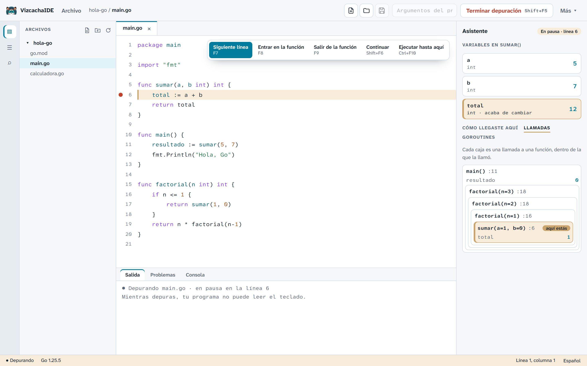
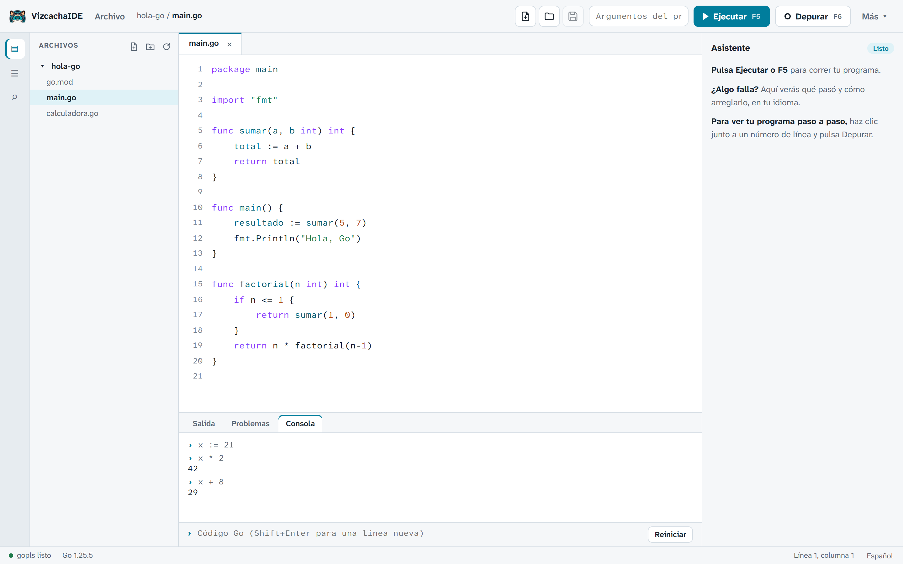
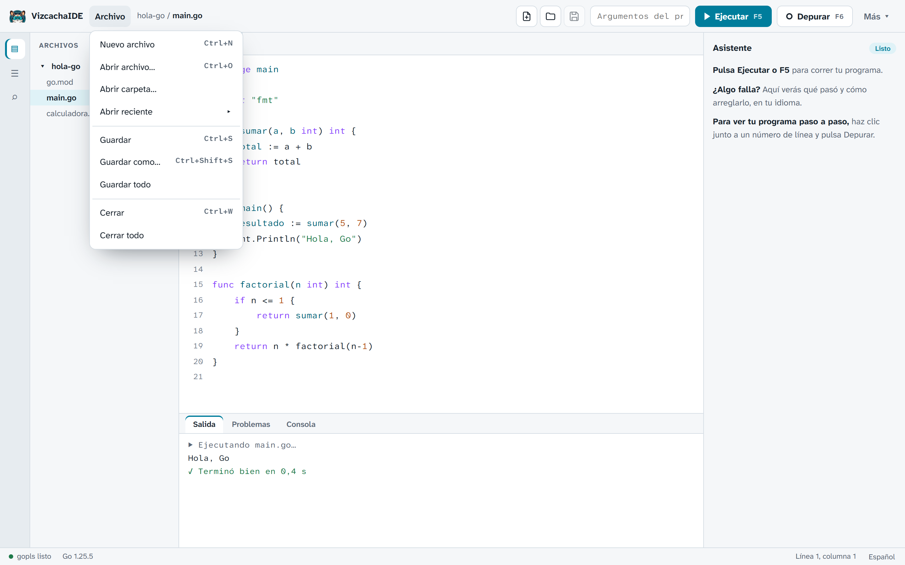
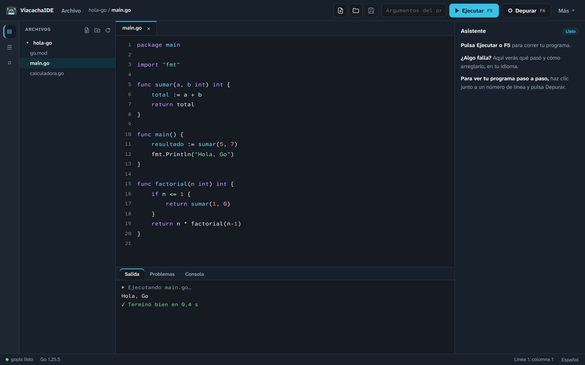

# VizcachaIDE

**Un IDE de Go amigable para quien recién empieza. Escribe, ejecuta, entiende tus errores y depura paso a paso, en español o en inglés.**

[Read in English](README.md) · [Historial de cambios](CHANGELOG.md) · [Cómo contribuir](CONTRIBUTING.md) · [Sitio web](https://vizcacha.codeplai.pe) · [Descargar](https://github.com/codeplai/VizcachaIDE/releases)



VizcachaIDE es un IDE pequeño, de una sola ventana, para estudiantes, docentes y cualquier
persona que esté aprendiendo Go. Se inspira en [Thonny](https://thonny.org/), el IDE con el que
muchas personas aprenden Python: menos botones, más claridad, y la meta de que un principiante
pueda ver cómo se ejecuta su programa, sin la configuración que piden los IDE profesionales.

**Por qué existe.** En Codeplai construimos con Go y quisimos compartir una herramienta amable
para aprenderlo. El nombre viene de la *vizcacha*, el roedor andino del Perú que siempre se ve
relajado. Ese es el ánimo que queremos para quien escribe su primer programa.

> **Estado: edición 2.0.0-rc1 (versión candidata).** El producto principal es la nueva edición
> en [`wails/`](wails/) (backend en Go, Svelte 5 y CodeMirror 6). La edición original en PyQt5
> (1.x, carpeta `vizcacha/`) sigue disponible como [edición clásica](#edición-clásica-1x-pyqt5),
> en mantenimiento.

## Contenido

- [Capturas](#capturas)
- [Características](#características)
- [Descarga e instalación](#descarga-e-instalación)
- [Un proyecto nuevo: por qué Windows puede avisarte y por qué es seguro](#un-proyecto-nuevo-por-qué-windows-puede-avisarte-y-por-qué-es-seguro)
- [Atajos de teclado](#atajos-de-teclado)
- [Compilar desde el código fuente](#compilar-desde-el-código-fuente-edición-20)
- [Edición clásica 1.x (PyQt5)](#edición-clásica-1x-pyqt5)
- [Arquitectura](#arquitectura)
- [Limitaciones conocidas](#limitaciones-conocidas)
- [Licencia](#licencia), [créditos y contacto](#créditos-y-contacto)

## Capturas


*Pulsa F5 y mira la salida de tu programa.*


*El Asistente explica qué pasó y cómo arreglarlo, y deja a la vista el mensaje original de Go.*


*El depurador muestra las llamadas anidadas, como `factorial(n=3)`, para que la recursión deje de ser un misterio.*


*La consola de Go: prueba una expresión o una instrucción sin crear un archivo.*


*Menú Archivo con Nuevo, Abrir, Guardar, Guardar como y archivos recientes.*


*Tema claro y tema oscuro.*

## Características

### Escribir y ejecutar
- **Ejecuta con F5.** Detén con Shift+F5, o con Ctrl+C para una detención ordenada.
- Los programas que leen del teclado funcionan: escribe tus datos en el panel de Salida (stdin).
- Argumentos para el programa y proyectos con `go.mod` (se ejecuta el módulo completo).
- **gofmt al guardar**, para que tu código siempre tenga el formato estándar.
- Colores ANSI en la salida.

### Entender tus errores: el Asistente
- Explica **25 errores comunes de Go** en español e inglés: qué pasó, cómo arreglarlo y el
  mensaje original de Go (nunca se traduce, para que puedas buscarlo).
- También explica las advertencias de `go vet`.
- **Diagnósticos en vivo con gopls**: los problemas se subrayan mientras escribes, antes de ejecutar.
- Autocompletado (Ctrl+Espacio), documentación al pasar el cursor e ir a la definición (F12 o Ctrl+clic).

### Depurar paso a paso (Delve)
- Puntos de interrupción, **siguiente línea**, **entrar en la función**, **salir de la función** y
  **ejecutar hasta aquí**.
- **Variables** con resaltado de "acaba de cambiar", para ver qué hizo la última línea.
- **Pila de llamadas** y **goroutines**.
- **Vista de llamadas anidadas**: las llamadas en forma de árbol con sus argumentos, por ejemplo
  `factorial(n=3)`.

### Consola de Go
Una consola (basada en el intérprete [yaegi](https://github.com/traefik/yaegi)) donde puedes
probar expresiones e instrucciones de Go al instante, como el intérprete de Python en Thonny.

### Archivos y comodidad diaria
- **Menú Archivo** y botones Nuevo / Abrir / Guardar; **Guardar como**; archivos recientes.
- **Panel de archivos** con clic derecho: renombrar, mover a la Papelera de reciclaje, mostrar en
  el explorador.
- Los archivos modificados fuera del IDE se recargan automáticamente.
- Clic derecho en Salida, Problemas y Consola: copiar, copiar todo, pegar, seleccionar todo, limpiar.
- **Gestor de módulos de Go** (init, get, tidy) sin abrir una terminal.
- **Asistente de primer uso** que revisa tus herramientas.
- Tema claro y oscuro.
- **Español e inglés**, detectados automáticamente según tu sistema.
- La ventana recuerda su tamaño, su posición y si estaba maximizada.

## Descarga e instalación

Descarga los instaladores desde [GitHub Releases](https://github.com/codeplai/VizcachaIDE/releases).
Hay dos variantes:

| Variante | Qué incluye | Tamaño | Elígela si... |
|---|---|---|---|
| **completa** (full) | El IDE + Go 1.25, Delve y gopls | Zip portable de unos 91 MB, instalador de unos 60 MB | Aún no tienes Go, o quieres una configuración para el aula que funcione sin internet. |
| **ligera** (lite) | Solo el IDE | Unos 10 MB | Ya tienes Go instalado. |

| Plataforma | Estado |
|---|---|
| Windows 10/11 x64 | Probada. Instalador (por usuario, sin permisos de administrador) o zip portable. |
| macOS y Linux | **Vista previa**: las genera la integración continua (CI), aún sin probar en equipos reales. |

La versión portable solo necesita **WebView2**, que ya viene con Windows 11 y con Windows 10
actualizado. Descomprime el zip y ejecuta `vizcacha.exe`.

## Un proyecto nuevo: por qué Windows puede avisarte y por qué es seguro

VizcachaIDE es un **proyecto nuevo e independiente**, hecho en Perú por
[Codeplai Games](https://codeplai.pe). Sus instaladores **todavía no tienen firma digital**, así
que la primera vez que abras uno, Windows SmartScreen puede mostrar *"Windows protegió tu PC"* y
decir que el editor es desconocido. Esto pasa con todo programa nuevo sin firma. No significa que
se haya encontrado un virus. Para continuar, haz clic en **Más información y luego en Ejecutar de
todas formas**. (En macOS la app aún no está notarizada: haz clic derecho sobre ella y elige
**Abrir**.)

No tienes que creernos solo de palabra:

- **El código fuente es público:** cada línea está en
  **[github.com/codeplai/VizcachaIDE](https://github.com/codeplai/VizcachaIDE)**, con licencia MIT.
  Puedes leerlo y [compilarlo tú mismo](#compilar-desde-el-código-fuente-edición-20).
- **Puedes verificar tu descarga:** cada versión incluye un archivo `SHA256SUMS`. En PowerShell,
  `Get-FileHash .\<archivo descargado>` debe mostrar el mismo valor que aparece en ese archivo.
- **Las herramientas incluidas son las oficiales:** Go, Delve y gopls vienen de sus fuentes
  oficiales, y el script de empaquetado comprueba cada descarga contra un SHA-256 fijo.

**Sobre la firma:** pensamos comprar un certificado de firma de código a medida que el proyecto
crezca, para que Windows reconozca al editor y el aviso desaparezca. Mientras tanto, el código
público y las sumas de verificación son la forma de comprobar lo que instalas.

## Atajos de teclado

| Acción | Atajo |
|---|---|
| Ejecutar / Detener (o detener la depuración) | F5 / Shift+F5 |
| Depurar / Continuar | F6 / Shift+F6 |
| Siguiente línea / Entrar / Salir | F7 / F8 / F9 |
| Ejecutar hasta aquí | Ctrl+F10 |
| Nuevo / Abrir / Guardar | Ctrl+N / Ctrl+O / Ctrl+S |
| Guardar como | Ctrl+Shift+S |
| Cerrar pestaña | Ctrl+W |
| Buscar | Ctrl+F |
| Ir a la línea | Ctrl+G |
| Ir a la definición | F12 o Ctrl+clic |
| Sugerencias | Ctrl+Espacio |
| Acercar / Alejar / Restablecer zoom | Ctrl++ / Ctrl+- / Ctrl+0 |

## Compilar desde el código fuente (edición 2.0)

Requisitos: Go 1.25 o superior, Node 24 y la CLI de Wails v2.16
(`go install github.com/wailsapp/wails/v2/cmd/wails@v2.16.0`).

```bash
git clone https://github.com/codeplai/VizcachaIDE.git
cd VizcachaIDE/wails
wails dev        # app de escritorio con recarga en caliente
wails build      # compila la app en build/bin/
```

Pruebas:

```bash
cd wails
go test ./...
cd frontend && npm run check && npx vitest run
```

Para generar los paquetes de la versión (completa y ligera):

```bash
python wails/packaging/build_release.py --variant both
```

Más detalles (dependencias en Linux, puente simulado, traducciones, reglas de arquitectura) en
[`wails/README.md`](wails/README.md).

## Edición clásica 1.x (PyQt5)

La primera edición, escrita en Python con PyQt5, sigue en el repositorio (carpeta `vizcacha/`).
Está en **mantenimiento**: solo recibe correcciones. Para ejecutarla necesitas Python 3.10 o
superior y Go:

```bash
pip install -r requirements.txt
python main.py
```

Los binarios clásicos incluyen PyQt5, que es GPLv3, así que esos paquetes 1.x se distribuyen bajo
GPLv3 (consulta [`packaging/NOTICE.md`](packaging/NOTICE.md)). La edición 2.0 no incluye PyQt.

## Arquitectura

La edición 2.0 tiene un backend en Go (dominio, casos de uso, adaptadores y un puente fino para
Wails) y un frontend en Svelte 5 + CodeMirror 6 que se comunica con él mediante un puente tipado.
Las integraciones con Delve y gopls son adaptadores, y las reglas de dependencias se verifican en CI.

- [Arquitectura](docs/ARCHITECTURE.md)
- [Comparativa con Thonny](docs/THONNY_COMPARISON.md)
- [Plan de desarrollo](docs/DEVELOPMENT_PLAN.md)
- [Plan de Wails](docs/wails/PLAN_WAILS.md)
- [README de Wails](wails/README.md) y [guía para contribuir](CONTRIBUTING.md)

## Limitaciones conocidas

- **Los instaladores no están firmados**: Windows SmartScreen puede avisarte, y la app de macOS no
  está notarizada (ver arriba).
- **Las compilaciones de macOS y Linux son una vista previa**: la CI las genera, pero no se han
  probado en equipos reales. Windows 10/11 x64 es la plataforma probada.
- **Mientras depuras, el programa no puede leer del teclado (stdin).** Para eso, ejecútalo con F5.
- **La consola de Go usa un intérprete** (yaegi). Funciona la mayor parte de la biblioteca estándar,
  pero no es exactamente lo mismo que compilar y ejecutar un programa.
- No planeado: MicroPython, TinyGo y microcontroladores.

## Licencia

[MIT](LICENSE), © 2025-2026 Marks Calderon – Codeplai Games. Los binarios clásicos 1.x son GPLv3
porque incluyen PyQt5.

## Créditos y contacto

Creado por **Marks Calderon**, CEO de Codeplai, en **Codeplai Games**. Hecho en Perú.

- Sitio web: [vizcacha.codeplai.pe](https://vizcacha.codeplai.pe) (código:
  [codeplai/vizcachaweb](https://github.com/codeplai/vizcachaweb))
- Contacto: [hola@codeplai.pe](mailto:hola@codeplai.pe)
- Gracias a [Thonny](https://thonny.org/) (inspiración), [Delve](https://github.com/go-delve/delve),
  [gopls](https://pkg.go.dev/golang.org/x/tools/gopls), [yaegi](https://github.com/traefik/yaegi),
  [Wails](https://wails.io/), [Svelte](https://svelte.dev/), [CodeMirror](https://codemirror.net/)
  y [el lenguaje Go](https://go.dev/).
