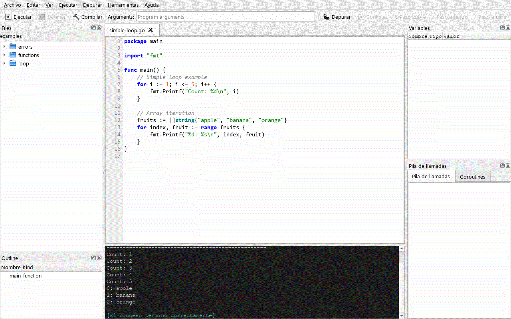
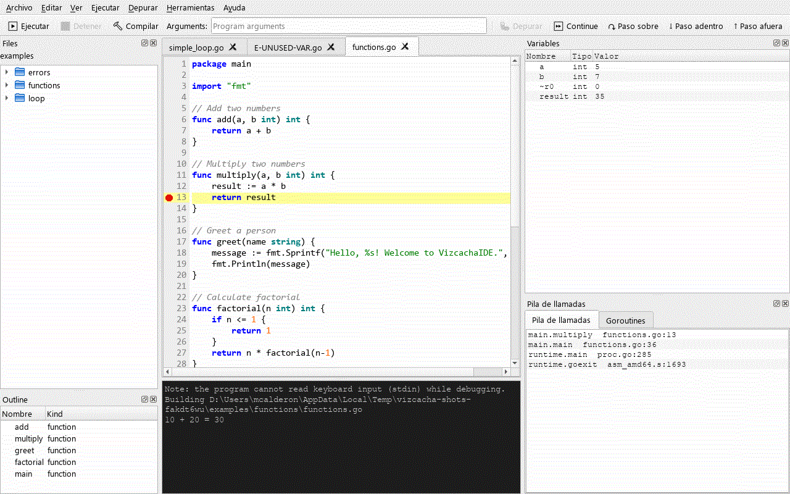
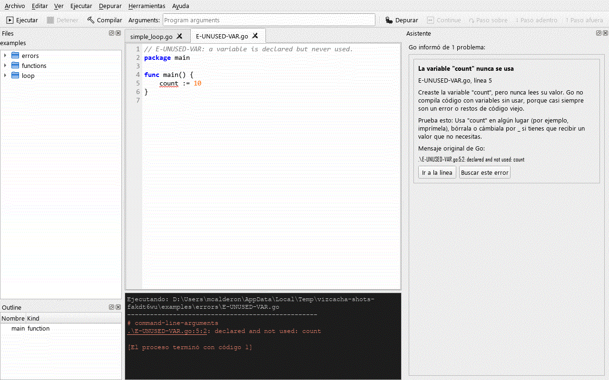

# VizcachaIDE

**Un IDE de Go para principiantes, inspirado en [Thonny](https://thonny.org/).**

[Read in English](README.md) · [Historial de cambios](CHANGELOG.md) · [Cómo contribuir](CONTRIBUTING.md) · [Notas de la versión 1.0.0-rc1](docs/release/notes-1.0.0-rc1.es.md)

VizcachaIDE es un IDE pequeño, de una sola ventana, pensado para quienes están aprendiendo Go.
Ejecuta tu programa con una tecla, te deja ver qué pasa por dentro con un depurador de verdad
y te explica los mensajes de error de Go en español o en inglés. La idea es la misma que tiene
Thonny con Python: que un principiante pueda *ver* cómo se ejecuta su programa, sin pelearse
con la configuración que piden los IDE profesionales.

> **Estado: versión candidata 1.0.0.** Todo lo que se describe abajo está implementado y
> cubierto por tests automáticos, incluidos tests de integración con Go, Delve y gopls reales.
> La versión de Windows se probó a mano; los paquetes de macOS y Linux son una **vista previa**
> (consulta [Limitaciones conocidas](#limitaciones-conocidas)).



## ¿Para quién es?

- Estudiantes y autodidactas que escriben sus primeros programas en Go.
- Docentes que quieren una herramienta para el aula con **todo en un solo instalador**
  (Go incluido).
- Quienes aprenden en español: la interfaz y las explicaciones de errores son bilingües.

No pretende reemplazar a GoLand o VS Code en el trabajo profesional.

## Funciones

### Editor
- Resaltado de sintaxis de Go, números de línea, emparejado de llaves y pestañas para varios
  archivos.
- Indentación con tabulaciones reales (como hace `gofmt`); el ancho visible se configura.
  Tab y Shift+Tab indentan o desindentan las líneas seleccionadas.
- **gofmt al guardar** (se puede desactivar) y *Editar → Format Code* (Ctrl+Shift+F; mientras se completa la traducción, algunos menús aparecen en inglés).
- Barra de buscar y reemplazar (Ctrl+F, Ctrl+H, F3), ir a línea (Ctrl+G), comentar y
  descomentar (Ctrl+/) y zoom (Ctrl+=, Ctrl+-, Ctrl+0).
- Archivos recientes (hasta 10). Si un archivo cambia fuera del IDE, se recarga solo o te
  pregunta qué hacer.
- 4 temas de editor (Light, Dark, Solarized Light y Solarized Dark) y 2 de consola (Dark y
  Light), o tus propios colores de fondo y de texto.

### Ejecutar
- **Ejecutar** (F5) usa `go run`, **Detener** (Shift+F5) para el programa y **Compilar**
  (Ctrl+B) lanza `go build`. La ventana no se congela mientras tanto.
- La consola muestra la salida con colores, acepta **entrada por teclado** para los programas
  que leen de stdin y convierte las referencias como `file.go:12:5` en enlaces que llevan a
  esa línea.
- Campo de **argumentos del programa** en la barra de herramientas (admite comillas).
- Las pestañas sin guardar ("Untitled") se pueden ejecutar directamente.
- **Módulos de Go:** si el archivo está en una carpeta con `go.mod`, se ejecuta el módulo
  completo (`go run .`). *Herramientas → Go Modules…* ejecuta `go mod init`,
  `go get <paquete>[@versión]` y `go mod tidy` sin abrir una terminal.
- *Archivo → Open Folder…* muestra el panel **Files** con el contenido de la carpeta.

### Depurador (Delve)
Un depurador real basado en [Delve](https://github.com/go-delve/delve) (`dlv dap`):



- Puntos de interrupción: haz clic en el número de línea o pulsa F10. Puedes ponerlos y
  quitarlos mientras el programa se ejecuta.
- Depurar (F6), Continuar (Shift+F6), Paso sobre (F7), Paso adentro (F8), Paso afuera (F9),
  Ejecutar hasta el cursor (Ctrl+F10) y Detener la depuración (Ctrl+F6).
- Panel de **Variables** con structs, slices y maps desplegables (el contenido se carga cuando
  lo abres), **Pila de llamadas** (un clic en un frame te lleva a su línea) y **Goroutines**.
- La línea actual queda resaltada y la salida del programa aparece en la consola.

### Asistente: los errores de Go explicados en español y en inglés
Cuando Go informa de un problema, se abre el panel **Asistente** con una explicación breve para
principiantes, una sugerencia para arreglarlo, el mensaje original de Go (nunca se traduce, para
que puedas buscarlo en internet) y los botones *Ir a la línea* y *Buscar este error*.



El catálogo reconoce **25 tipos de mensajes**: 16 errores de compilación (variable o import sin
usar, falta un return, nombre no definido, tipos que no coinciden, número incorrecto de
argumentos, `:=` sin variables nuevas, nombres no exportados, falta `main`…), 7 panics en tiempo
de ejecución (índice fuera de rango, map nil, puntero nil, deadlock, división por cero, límites
de un slice y aserción de tipo fallida) y 2 avisos de `go vet` (argumentos de Printf y código
inalcanzable). Cada uno tiene un programa mínimo de ejemplo en
[`examples/errors/`](examples/errors/).

### Inteligencia de código (gopls)
Con [gopls](https://pkg.go.dev/golang.org/x/tools/gopls) instalado (viene incluido en el
paquete *full*):

- Autocompletado con Ctrl+Space, que incluye tus propias funciones y cualquier paquete.
- Errores subrayados mientras escribes, justo en el tramo del código donde está el problema;
  el Asistente también los explica.
- Documentación al pasar el ratón, Ctrl+clic para ir a la definición, ayuda con los parámetros
  al escribir `(` y resaltado de las demás apariciones de un nombre.
- Panel **Outline** (disponible desde el arranque) con las funciones y los tipos del archivo
  actual.

Sin gopls, el editor usa una lista de autocompletado básica (palabras clave, funciones
integradas y las funciones más comunes de la biblioteca estándar) y lo avisa una vez en la
barra de estado.

### Configuración
*Herramientas → Opciones…* tiene tres páginas: **Entorno** (rutas de `go`, `dlv` y `gopls`,
`GOPATH`, `GOROOT`, variables de entorno adicionales y qué herramientas se detectaron y dónde),
**Editor** (fuente, tamaño, ancho del tabulador, autoindentado, números de línea, ajuste de línea
y formato al guardar) y **Apariencia** (temas, colores propios, barra de herramientas y barra
de estado).

Las herramientas se buscan en este orden: la ruta indicada en Opciones → las herramientas
incluidas en el paquete *full* → el `PATH`.

## Instalación

### Instaladores

Se descargan desde la página de [Releases](https://github.com/codeplai/VizcachaIDE/releases)
del proyecto. Hay dos variantes:

| Variante | Incluye | Elígela si… |
|---|---|---|
| **full** | El IDE + Go 1.25.14, Delve 1.27.2 y gopls 0.21.1 | Aún no tienes Go, o quieres algo para el aula que funcione sin internet. No hay que instalar nada más. |
| **lite** | Sólo el IDE | Ya tienes Go instalado (y, si quieres, `dlv` y `gopls`). |

| Plataforma | Archivos | Estado |
|---|---|---|
| Windows 10/11 x64 | `…-windows-x64-full-setup.exe`, `…-lite-setup.exe`, `…-portable.zip` | Aplicación probada a mano; el instalador aún no se ha probado |
| macOS 11+ (Apple Silicon / Intel) | `…-macos-arm64-full.dmg`, `…-macos-x86_64-full.dmg` (y `lite`) | **Vista previa**, sin probar todavía |
| Linux x86_64 | `…-linux-x86_64-full.AppImage` (y `lite`) | **Vista previa**, sin probar todavía |

- **Windows:** el instalador es por usuario (no necesita permisos de administrador) y permite
  instalar para todos los usuarios, crear un acceso directo en el escritorio y abrir los
  archivos `.go` con VizcachaIDE. Está en español y en inglés. El zip no necesita instalación.
- **macOS:** la app no está notarizada: la primera vez, haz clic derecho sobre ella y elige
  **Abrir**.
- **Linux:** `chmod +x VizcachaIDE-*.AppImage` y ejecútalo. Necesita las bibliotecas de Qt/X11
  habituales (`libxkbcommon-x11-0`, `libxcb-*`, `libegl1`, `libfontconfig1`) y glibc 2.35 o
  posterior.

La variante *lite* necesita Go en el sistema (se recomienda Go 1.21 o posterior; las pruebas se
hicieron con la 1.25). Para depurar instala Delve, y para la inteligencia de código, gopls:

```bash
go install github.com/go-delve/delve/cmd/dlv@latest
go install golang.org/x/tools/gopls@latest
```

> **Sobre la licencia de los instaladores.** El código fuente de VizcachaIDE es MIT. Pero los
> instaladores incluyen también PyQt5, que tiene licencia GPLv3, así que **el programa
> distribuido, en su conjunto, queda bajo la GPLv3**. El instalador de Windows muestra este
> aviso, y todos los paquetes incluyen [`NOTICE.md`](packaging/NOTICE.md) y el texto de la GPL.
> La GPL se aplica al IDE, no a los programas de Go que escribas con él.

### Desde el código fuente

Requisitos: Python 3.10 o posterior, Go (se recomienda 1.21 o posterior) y, si quieres, `dlv`
y `gopls` en el `PATH`.

```bash
git clone https://github.com/codeplai/VizcachaIDE.git
cd VizcachaIDE
python -m venv .venv
.venv/Scripts/activate              # Windows  (Linux/macOS: source .venv/bin/activate)
pip install -r requirements.txt
python -m vizcacha                  # o bien: python main.py
```

Para generar tú mismo los instaladores, consulta [`packaging/README.md`](packaging/README.md).

## Primeros pasos

1. Abre VizcachaIDE. Ya hay una pestaña vacía: escribe un programa o abre alguno de los
   [`examples/`](examples/) con *Archivo → Abrir…* (Ctrl+O).
   ```go
   package main

   import "fmt"

   func main() {
   	fmt.Println("¡Hola, VizcachaIDE!")
   }
   ```
2. Pulsa **F5** para ejecutarlo. La salida aparece en la consola de abajo.
3. Equivócate a propósito (por ejemplo, declara una variable y no la uses) y vuelve a pulsar
   F5: el Asistente te explica el error.
4. Guarda el archivo (Ctrl+S), haz clic en un número de línea para poner un punto de
   interrupción y pulsa **F6** para depurar. Avanza con F7, F8 y F9 y mira el panel Variables.

## Atajos de teclado

| Acción | Atajo |
|---|---|
| Nuevo / Abrir / Guardar / Guardar como | Ctrl+N / Ctrl+O / Ctrl+S / Ctrl+Shift+S |
| Deshacer / Rehacer | Ctrl+Z / Ctrl+Y (Linux: Ctrl+Shift+Z) |
| Buscar / Reemplazar | Ctrl+F / Ctrl+H |
| Buscar siguiente / anterior | F3 / Shift+F3 |
| Ir a línea | Ctrl+G |
| Comentar o descomentar | Ctrl+/ |
| Formatear código (gofmt) | Ctrl+Shift+F |
| Acercar / alejar / restablecer zoom | Ctrl+= / Ctrl+- / Ctrl+0 |
| Autocompletar | Ctrl+Space |
| Ir a la definición | Ctrl+clic |
| Ejecutar / Detener / Compilar | F5 / Shift+F5 / Ctrl+B |
| Depurar / Continuar / Detener la depuración | F6 / Shift+F6 / Ctrl+F6 |
| Paso sobre / Paso adentro / Paso afuera | F7 / F8 / F9 |
| Poner o quitar un punto de interrupción | F10 (o clic en el número de línea) |
| Ejecutar hasta el cursor | Ctrl+F10 |

Nuevo, Abrir, Guardar, Deshacer, Rehacer, Cortar, Copiar, Pegar y Salir usan las teclas
estándar de cada sistema (en macOS, ⌘ en lugar de Ctrl; Salir es Ctrl+Q en Linux y ⌘Q en macOS).

## Idiomas

La interfaz, los mensajes de la consola y las explicaciones del Asistente están en **español**
y en **inglés**. VizcachaIDE usa el idioma del sistema operativo (cualquier configuración
regional `es*` → español; cualquier otra → inglés). Los mensajes de error originales de Go se
muestran siempre tal como Go los escribe.

La traducción al español de esta versión candidata todavía no está completa: algunos textos
siguen en inglés y aún no hay un selector de idioma dentro de la aplicación (consulta
[Limitaciones conocidas](#limitaciones-conocidas)).

## Arquitectura

VizcachaIDE sigue la Clean Architecture con cuatro capas, que
[import-linter](https://import-linter.readthedocs.io/) comprueba automáticamente:

```
vizcacha/
├── domain/          modelo en Python puro (sin Qt): depuración, diagnósticos, explicaciones, proyecto
├── application/     puertos (typing.Protocol) y casos de uso
├── infrastructure/  adaptadores: toolchain de Go, Delve DAP, gopls LSP, catálogo de errores, configuración
├── i18n/            catálogos gettext (inglés / español), mantenidos con Babel
└── ui/              PyQt5; cada función se conecta al Workbench con register(workbench)
```

Más detalle: [docs/ARQUITECTURA.md](docs/ARQUITECTURA.md),
[docs/PLAN_DESARROLLO.md](docs/PLAN_DESARROLLO.md) y
[docs/COMPARATIVA_THONNY.md](docs/COMPARATIVA_THONNY.md). La guía
[CONTRIBUTING.md](CONTRIBUTING.md) explica las reglas (en inglés, con un resumen en español).

## Desarrollo

```bash
pip install -r requirements-dev.txt
python -m pytest                    # tests; los de integración con Go/Delve/gopls se ejecutan si están en el PATH
ruff check . && lint-imports        # estilo + contratos de arquitectura
python docs/release/make_screenshots.py   # regenera las capturas de docs/images/
```

En [CONTRIBUTING.md](CONTRIBUTING.md) se explica cómo añadir una función, una traducción o un
error nuevo al Asistente.

## Limitaciones conocidas

- **Los paquetes de macOS y Linux son una vista previa:** los scripts existen, pero el `.dmg` y
  el AppImage todavía no se han probado en máquinas reales. Los workflows de GitHub Actions
  (CI y release) tampoco se han ejecutado aún.
- El instalador de Windows (Inno Setup) todavía no se ha compilado en el entorno de release; sí
  se verificaron las carpetas de PyInstaller y el zip portable.
- Sin firma de código: SmartScreen de Windows puede avisar de un editor desconocido y la app de
  macOS no está notarizada.
- La traducción al español está incompleta y el idioma sólo se puede cambiar con el idioma del
  sistema operativo (aún no hay selector en Opciones).
- Mientras depuras, el programa no puede leer del teclado (stdin).
- Para depurar hay que guardar el archivo; el panel Files sólo aparece después de
  *Archivo → Open Folder…*.
- La disposición inicial de los paneles todavía se está mejorando (al principio el Asistente
  puede verse pequeño: arrastra su borde o despégalo).
- No está previsto: MicroPython, TinyGo ni microcontroladores.

## Licencia

- **Código fuente:** [MIT](LICENSE), © 2025-2026 Marks Calderon – Codeplai Games.
- **Binarios distribuidos:** incluyen PyQt5 (GPLv3), así que los instaladores y paquetes, en su
  conjunto, quedan bajo la **GPLv3**. En [`packaging/NOTICE.md`](packaging/NOTICE.md) está la
  lista completa de componentes incluidos y sus licencias (Qt LGPLv3, Python PSF, Go y gopls
  BSD de 3 cláusulas, Delve MIT).

## Créditos

- [Thonny](https://thonny.org/), el IDE de Python para principiantes que inspiró este proyecto.
- [Delve](https://github.com/go-delve/delve), el depurador de Go.
- [gopls](https://pkg.go.dev/golang.org/x/tools/gopls), el servidor de lenguaje de Go, y
  [lsprotocol](https://github.com/microsoft/lsprotocol) por sus tipos.
- [PyQt5](https://www.riverbankcomputing.com/software/pyqt/) y [Qt](https://www.qt.io/).
- [El lenguaje de programación Go](https://go.dev/).

Creado por Marks Calderon (Codeplai Games, Perú) para todas las personas que están aprendiendo Go.
