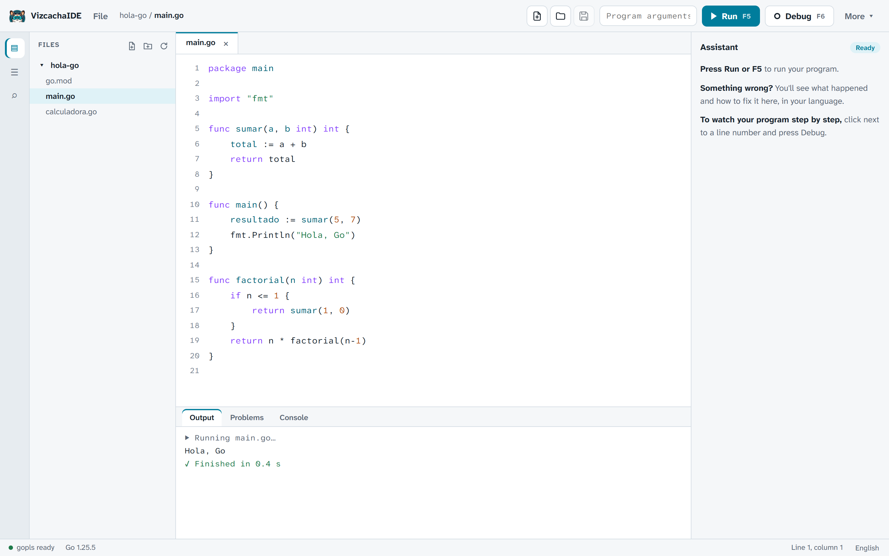
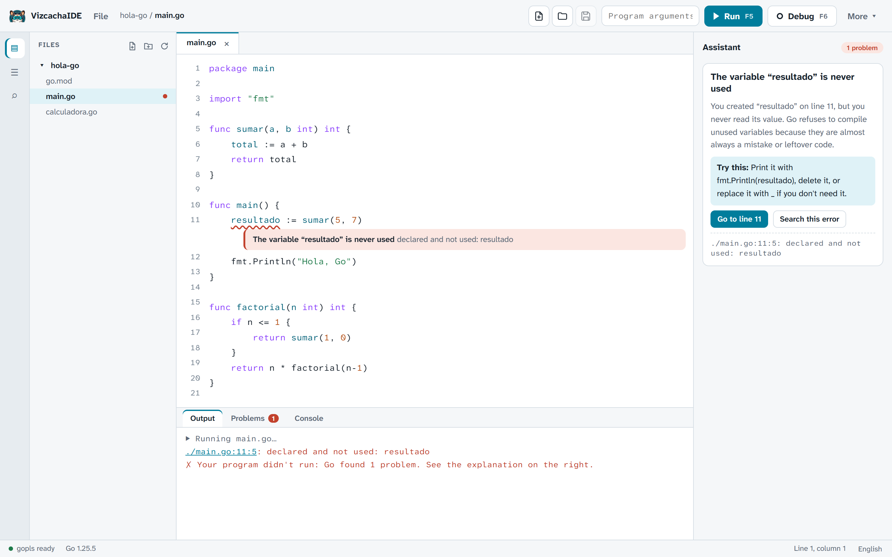
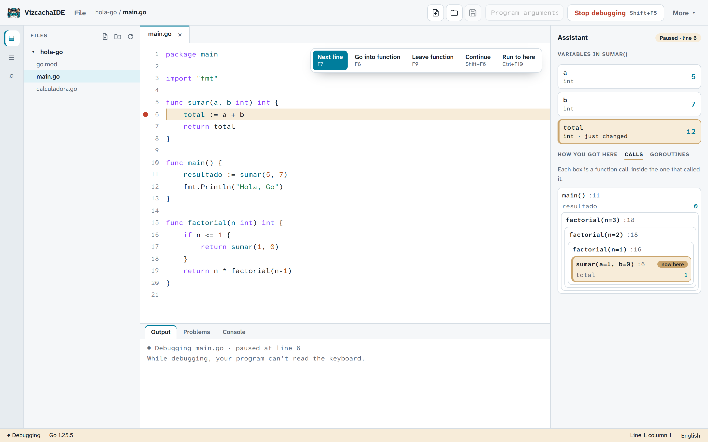
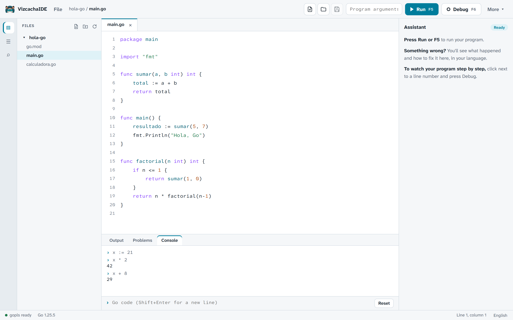
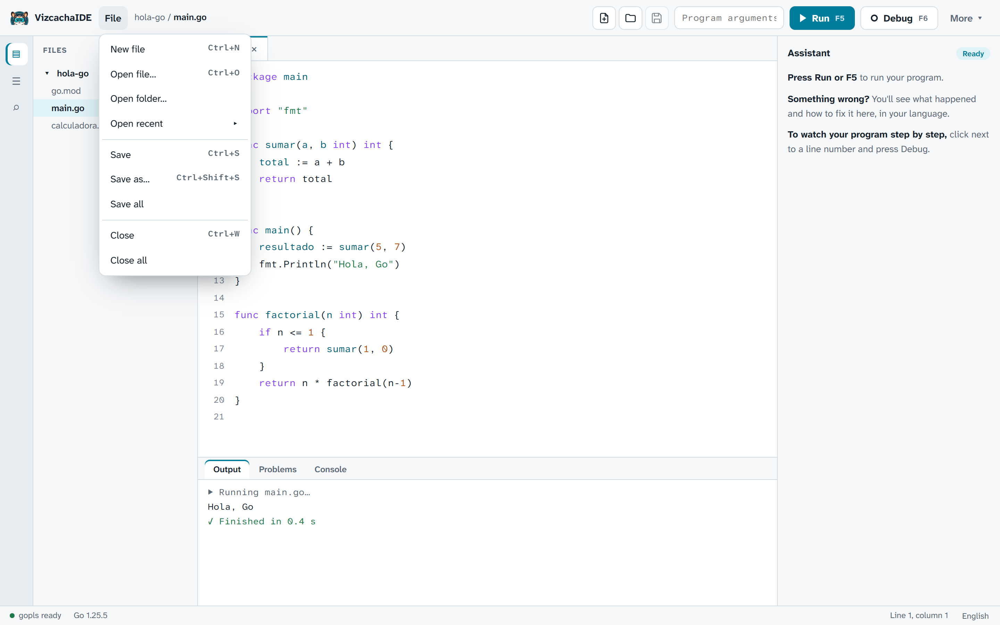
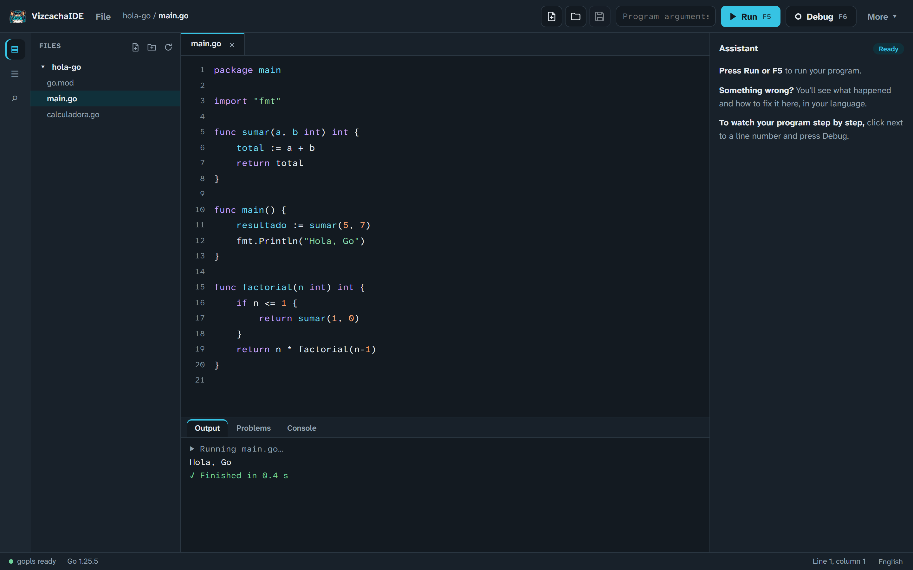

# VizcachaIDE

**A friendly Go IDE for people who are just starting. Write, run, understand your errors and debug step by step, in English or Spanish.**

[Leer en español](README.es.md) · [Changelog](CHANGELOG.md) · [Contributing](CONTRIBUTING.md) · [Website](https://vizcacha.codeplai.pe) · [Download](https://github.com/codeplai/VizcachaIDE/releases)



VizcachaIDE is a small, single-window IDE for students, teachers and anyone learning Go. It
is inspired by [Thonny](https://thonny.org/), the IDE many people use to learn Python: fewer
buttons, more clarity, and the goal of making the execution of a program visible to a
beginner without the setup that professional IDEs ask for.

**Why it exists.** At Codeplai we build with Go, and we wanted to share a friendly tool to
learn it. The name comes from the *vizcacha*, the Andean rodent from Peru that always looks
relaxed. That is the mood we want for someone writing their first program.

> **Status: edition 2.0.0-rc1 (release candidate).** The main product is the new edition in
> [`wails/`](wails/) (Go backend, Svelte 5 and CodeMirror 6). The original PyQt5 edition
> (1.x, folder `vizcacha/`) stays available as the [classic edition](#classic-edition-1x-pyqt5),
> in maintenance.

## Contents

- [Screenshots](#screenshots)
- [Features](#features)
- [Download and install](#download-and-install)
- [A new project: why Windows may warn you, and why it is safe](#a-new-project-why-windows-may-warn-you-and-why-it-is-safe)
- [Keyboard shortcuts](#keyboard-shortcuts)
- [Build from source](#build-from-source-edition-20)
- [Classic edition 1.x (PyQt5)](#classic-edition-1x-pyqt5)
- [Architecture](#architecture)
- [Known limitations](#known-limitations)
- [License](#license), [credits and contact](#credits-and-contact)

## Screenshots


*Press F5 and see the output of your program.*


*The Assistant explains what happened and how to fix it, and keeps Go's original message in view.*


*The debugger shows nested calls, such as `factorial(n=3)`, so recursion stops being a mystery.*


*The Go console: try an expression or a statement without creating a file.*


*File menu with New, Open, Save, Save as and recent files.*


*Light and dark themes.*

## Features

### Write and run
- **Run with F5.** Stop with Shift+F5, or with Ctrl+C for a graceful stop.
- Programs that read from the keyboard work: type your input in the Output panel (stdin).
- Program arguments, and projects with `go.mod` (the whole module is run).
- **gofmt on save**, so your code is always formatted the standard way.
- ANSI colors in the output.

### Understand your errors: the Assistant
- Explains **25 common Go errors** in English and Spanish: what happened, how to fix it, and the
  original Go message (never translated, so you can search for it).
- Also explains `go vet` warnings.
- **Live diagnostics with gopls**: problems are underlined while you type, before you run.
- Completion (Ctrl+Space), documentation on hover and go to definition (F12 or Ctrl+click).

### Debug step by step (Delve)
- Breakpoints, **next line**, **step into**, **step out** and **run to here**.
- **Variables** with a "just changed" highlight, so you can see what the last line did.
- **Call stack** and **goroutines**.
- **Nested calls view**: calls shown as a tree with their arguments, for example `factorial(n=3)`.

### Go console
A console (powered by the [yaegi](https://github.com/traefik/yaegi) interpreter) where you can try
Go expressions and statements at once, like the Python shell in Thonny.

### Files and everyday comfort
- **File menu** and New / Open / Save buttons; **Save as**; recent files.
- **Files panel** with right click: rename, move to the Recycle Bin, reveal in the file manager.
- Files changed outside the IDE are reloaded automatically.
- Right click in Output, Problems and Console: copy, copy all, paste, select all, clear.
- **Go modules manager** (init, get, tidy) without opening a terminal.
- **First-run wizard** that checks your tools.
- Light and dark themes.
- **English and Spanish**, detected automatically from your system.
- The window remembers its size, position and maximized state.

## Download and install

Get the installers from [GitHub Releases](https://github.com/codeplai/VizcachaIDE/releases).
There are two variants:

| Variant | Contains | Size | Choose it if... |
|---|---|---|---|
| **full** | The IDE + Go 1.25, Delve and gopls | Portable zip about 91 MB, installer about 60 MB | You don't have Go yet, or you want a classroom setup that works offline. |
| **lite** | The IDE only | About 10 MB | You already have Go installed. |

| Platform | Status |
|---|---|
| Windows 10/11 x64 | Tested. Installer (per user, no administrator rights) or portable zip. |
| macOS and Linux | **Preview**: built by CI, not tested on real machines yet. |

The portable version needs nothing but **WebView2**, which already comes with Windows 11 and
up-to-date Windows 10. Just unzip it and run `vizcacha.exe`.

## A new project: why Windows may warn you, and why it is safe

VizcachaIDE is a **new, independent project**, made in Peru by
[Codeplai Games](https://codeplai.pe). Its installers are **not digitally signed yet**, so the
first time you open one, Windows SmartScreen may show *"Windows protected your PC"* and say the
publisher is unknown. This happens with every new program that has no signature. It does not mean
that a virus was found. To continue, click **More info, then Run anyway**. (On macOS the app is not
notarized yet: right-click it and choose **Open**.)

You don't have to take our word for it:

- **The source code is public:** every line is at
  **[github.com/codeplai/VizcachaIDE](https://github.com/codeplai/VizcachaIDE)**, under the MIT
  license. You can read it and [build it yourself](#build-from-source-edition-20).
- **You can check your download:** each release includes a `SHA256SUMS` file. In PowerShell,
  `Get-FileHash .\<downloaded file>` must print the same value that is in that file.
- **The bundled tools are the official ones:** Go, Delve and gopls come from their official
  sources, and the packaging script checks each download against a fixed SHA-256.

**About the signature:** we plan to buy a code-signing certificate as the project grows, so that
Windows recognizes the publisher and the warning goes away. Until then, the public code and the
checksums are how you can verify what you install.

## Keyboard shortcuts

| Action | Shortcut |
|---|---|
| Run / Stop (or stop debugging) | F5 / Shift+F5 |
| Debug / Continue | F6 / Shift+F6 |
| Next line / Step into / Step out | F7 / F8 / F9 |
| Run to here | Ctrl+F10 |
| New / Open / Save | Ctrl+N / Ctrl+O / Ctrl+S |
| Save as | Ctrl+Shift+S |
| Close tab | Ctrl+W |
| Find | Ctrl+F |
| Go to line | Ctrl+G |
| Go to definition | F12 or Ctrl+click |
| Suggestions | Ctrl+Space |
| Zoom in / out / reset | Ctrl++ / Ctrl+- / Ctrl+0 |

## Build from source (edition 2.0)

Requirements: Go 1.25 or newer, Node 24, and the Wails CLI v2.16
(`go install github.com/wailsapp/wails/v2/cmd/wails@v2.16.0`).

```bash
git clone https://github.com/codeplai/VizcachaIDE.git
cd VizcachaIDE/wails
wails dev        # desktop app with hot reload
wails build      # builds the app into build/bin/
```

Tests:

```bash
cd wails
go test ./...
cd frontend && npm run check && npx vitest run
```

To produce the release packages (full and lite):

```bash
python wails/packaging/build_release.py --variant both
```

More details (Linux dependencies, mock bridge, translations, architecture rules) are in
[`wails/README.md`](wails/README.md).

## Classic edition 1.x (PyQt5)

The first edition, written in Python with PyQt5, is still in the repository (folder
`vizcacha/`). It is in **maintenance**: it only receives fixes. To run it you need Python 3.10 or
newer and Go:

```bash
pip install -r requirements.txt
python main.py
```

The classic binaries bundle PyQt5, which is GPLv3, so those 1.x packages are distributed under
the GPLv3 (see [`packaging/NOTICE.md`](packaging/NOTICE.md)). Edition 2.0 does not include PyQt.

## Architecture

Edition 2.0 has a Go backend (domain, use cases, adapters and a thin bridge for Wails) and a
Svelte 5 + CodeMirror 6 frontend that talks to it through a typed bridge. The Delve and gopls
integrations are adapters, and the dependency rules are checked in CI.

- [Architecture](docs/ARCHITECTURE.md)
- [Comparison with Thonny](docs/THONNY_COMPARISON.md)
- [Development plan](docs/DEVELOPMENT_PLAN.md)
- [Wails plan](docs/wails/PLAN_WAILS.md)
- [Wails README](wails/README.md) and [contributor guide](CONTRIBUTING.md)

## Known limitations

- **The installers are not signed**: Windows SmartScreen may warn you, and the macOS app is not
  notarized (see above).
- **macOS and Linux builds are a preview**: CI produces them, but they have not been tested on real
  machines. Windows 10/11 x64 is the tested platform.
- **While debugging, the program cannot read the keyboard (stdin).** Run it normally with F5 for
  that.
- **The Go console uses an interpreter** (yaegi). Most of the standard library works, but it is not
  exactly the same as compiling and running a program.
- Not planned: MicroPython, TinyGo and microcontrollers.

## License

[MIT](LICENSE), (c) 2025-2026 Marks Calderon - Codeplai Games. The classic 1.x binaries are GPLv3
because they bundle PyQt5.

## Credits and contact

Created by **Marks Calderon**, CEO of Codeplai, at **Codeplai Games**. Made in Peru.

- Website: [vizcacha.codeplai.pe](https://vizcacha.codeplai.pe) (source:
  [codeplai/vizcachaweb](https://github.com/codeplai/vizcachaweb))
- Contact: [hola@codeplai.pe](mailto:hola@codeplai.pe)
- Thanks to [Thonny](https://thonny.org/) (inspiration), [Delve](https://github.com/go-delve/delve),
  [gopls](https://pkg.go.dev/golang.org/x/tools/gopls), [yaegi](https://github.com/traefik/yaegi),
  [Wails](https://wails.io/), [Svelte](https://svelte.dev/), [CodeMirror](https://codemirror.net/)
  and [the Go programming language](https://go.dev/).
