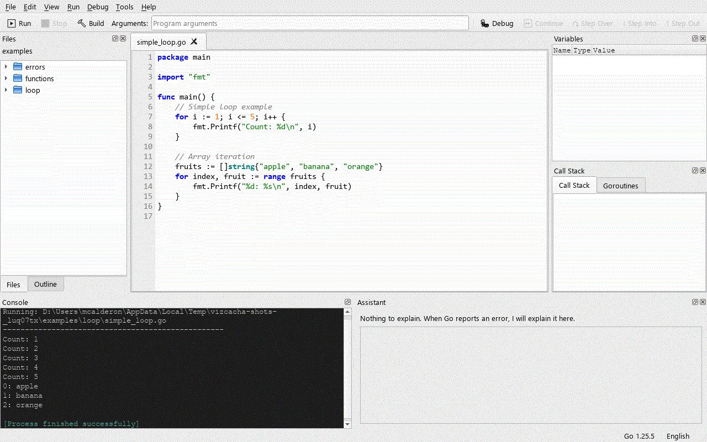
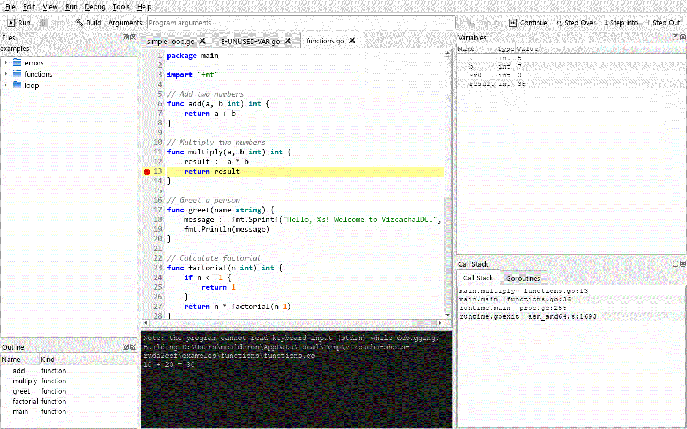
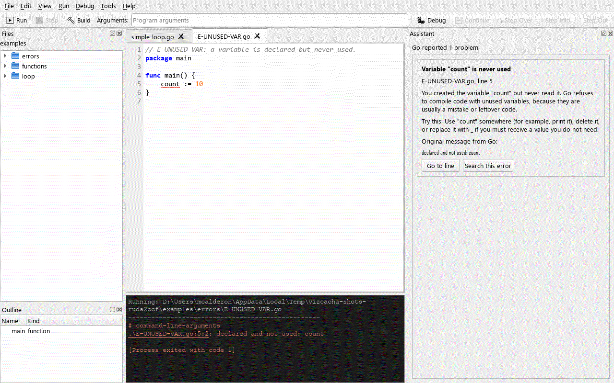

# VizcachaIDE

**A beginner-friendly IDE for Go, inspired by [Thonny](https://thonny.org/).**

[Leer en español](README.es.md) · [Changelog](CHANGELOG.md) · [Contributing](CONTRIBUTING.md) · [Release notes 1.0.0-rc1](docs/release/notes-1.0.0-rc1.en.md)

VizcachaIDE is a small, single-window IDE for people who are learning Go. It runs your
program with one key, shows you what is going on inside it with a real debugger, and explains
Go's error messages in plain English or Spanish. The goal is the one Thonny has for Python:
make the execution of a program visible to a beginner, without the configuration that
professional IDEs require.

> **Status: 1.0.0 release candidate.** The features below are implemented and covered by
> automated tests, including integration tests against real Go, Delve and gopls. The Windows
> build has been verified by hand; the macOS and Linux packages are a **preview** (see
> [Known limitations](#known-limitations)).



## Who is it for?

- Students and self-taught programmers writing their first Go programs.
- Teachers who want a classroom tool with **everything in one installer** (Go included).
- Spanish-speaking learners: the interface and the error explanations are bilingual.

It is not meant to replace GoLand or VS Code for professional work.

## Features

### Editor
- Go syntax highlighting, line numbers, bracket matching and tabs for several files.
- Indentation with real tabs (as `gofmt` does); the visual width is configurable.
  Tab / Shift+Tab indent or unindent the selected lines.
- **gofmt on save** (can be turned off) and *Edit → Format Code* (Ctrl+Shift+F).
- Find / Replace bar (Ctrl+F, Ctrl+H, F3), Go to Line (Ctrl+G), toggle comment (Ctrl+/),
  zoom (Ctrl+=, Ctrl+-, Ctrl+0).
- Recent files (up to 10) and automatic reload or a prompt when a file changes outside the IDE.
- 4 editor themes (Light, Dark, Solarized Light, Solarized Dark) and 2 console themes
  (Dark, Light), or your own background and text colors.

### Run
- **Run** (F5) uses `go run`, **Stop** (Shift+F5) stops the program, **Build** (Ctrl+B) runs
  `go build`. Running and building do not freeze the window.
- The console shows the output in color, accepts **keyboard input** for programs that read
  from stdin, and turns `file.go:12:5` locations into links that open the line.
- **Program arguments** field in the toolbar (quotes are supported).
- Unsaved ("Untitled") tabs can be run directly.
- **Go modules:** if the file is inside a folder with a `go.mod`, the whole module is run
  (`go run .`). *Tools → Go Modules…* runs `go mod init`, `go get <package>[@version]` and
  `go mod tidy` without opening a terminal.
- *File → Open Folder…* shows the **Files** panel with the folder's contents.

### Debugger (Delve)
A real debugger based on [Delve](https://github.com/go-delve/delve) (`dlv dap`):



- Breakpoints: click the line number or press F10. They can be added and removed while the
  program is running.
- Debug (F6), Continue (Shift+F6), Step Over (F7), Step Into (F8), Step Out (F9),
  Run to Cursor (Ctrl+F10) and Stop Debugging (Ctrl+F6).
- **Variables** panel with expandable structs, slices and maps (children are loaded on demand),
  **Call Stack** (click a frame to jump to its line) and **Goroutines**.
- The current line is highlighted, and the program's output goes to the console.

### Assistant: Go errors explained in English and Spanish
When Go reports a problem, the **Assistant** panel opens with a short explanation for beginners,
a suggestion to fix it, the original message from Go (never translated, so you can search for it),
a *Go to line* button and a *Search this error* button.



The catalog recognises **25 kinds of messages**: 16 compiler errors (unused variable or import,
missing return, undefined name, type mismatch, wrong number of arguments, `:=` with no new
variables, unexported names, missing `main`…), 7 runtime panics (index out of range, nil map,
nil pointer, deadlock, division by zero, slice bounds, failed type assertion) and 2 `go vet`
checks (Printf arguments, unreachable code). Every one has a minimal example program in
[`examples/errors/`](examples/errors/).

### Code intelligence (gopls)
With [gopls](https://pkg.go.dev/golang.org/x/tools/gopls) installed (it is included in the
*full* package):

- Completion with Ctrl+Space, including your own functions and any package.
- Errors underlined while you type, over the exact range of the problem; the Assistant
  explains them too.
- Documentation on hover, Ctrl+click to go to a definition, parameter hints when you type `(`
  and highlighting of the other occurrences of a name.
- **Outline** panel (available from startup) with the functions and types of the current file.

Without gopls the editor falls back to a basic completion list (keywords, built-ins and common
standard-library functions) and shows a notice in the status bar once.

### Settings
*Tools → Options…* has three pages: **Environment** (paths to `go`, `dlv` and `gopls`,
`GOPATH`, `GOROOT`, extra environment variables, and which tools were detected and where),
**Editor** (font, size, tab width, auto-indent, line numbers, word wrap, format on save) and
**Appearance** (themes, custom colors, toolbar and status bar).

Tools are looked up in this order: the path set in Options → the toolchain bundled with the
*full* package → `PATH`.

## Installation

### Installers

Download them from the project's [Releases](https://github.com/codeplai/VizcachaIDE/releases)
page. There are two variants:

| Variant | Contains | Choose it if… |
|---|---|---|
| **full** | The IDE + Go 1.25.14, Delve 1.27.2 and gopls 0.21.1 | You don't have Go yet, or you want a classroom setup that works offline. Nothing else to install. |
| **lite** | The IDE only | You already have Go (and optionally `dlv` and `gopls`) installed. |

| Platform | Files | Status |
|---|---|---|
| Windows 10/11 x64 | `…-windows-x64-full-setup.exe`, `…-lite-setup.exe`, `…-portable.zip` | Application verified by hand; installer not tested yet |
| macOS 11+ (Apple Silicon / Intel) | `…-macos-arm64-full.dmg`, `…-macos-x86_64-full.dmg` (and `lite`) | **Preview**, not tested yet |
| Linux x86_64 | `…-linux-x86_64-full.AppImage` (and `lite`) | **Preview**, not tested yet |

- **Windows:** the installer is per user (no administrator rights needed) and can optionally
  install for all users, create a desktop shortcut and open `.go` files with VizcachaIDE.
  It is available in English and Spanish. The zip needs no installation.
- **macOS:** the app is not notarized: the first time, right-click it and choose **Open**.
- **Linux:** `chmod +x VizcachaIDE-*.AppImage` and run it. It needs the usual Qt/X11 libraries
  (`libxkbcommon-x11-0`, `libxcb-*`, `libegl1`, `libfontconfig1`) and glibc 2.35 or newer.

The *lite* variant needs Go on your system (Go 1.21 or newer is recommended; 1.25 is the
version used for testing). For debugging install Delve, and for code
intelligence install gopls:

```bash
go install github.com/go-delve/delve/cmd/dlv@latest
go install golang.org/x/tools/gopls@latest
```

> **About the license of the installers.** The VizcachaIDE source code is MIT. The installers,
> however, also contain PyQt5, which is licensed under the GPLv3, so **the distributed program
> as a whole is licensed under the GPLv3**. The Windows installer shows this notice, and every
> package includes [`NOTICE.md`](packaging/NOTICE.md) and the GPL text. The GPL covers the IDE
> itself, not the Go programs you write with it.

### From source

Requirements: Python 3.10 or newer, Go (1.21 or newer recommended), and optionally `dlv` and `gopls` on `PATH`.

```bash
git clone https://github.com/codeplai/VizcachaIDE.git
cd VizcachaIDE
python -m venv .venv
.venv/Scripts/activate              # Windows  (Linux/macOS: source .venv/bin/activate)
pip install -r requirements.txt
python -m vizcacha                  # or: python main.py
```

To build the installers yourself, see [`packaging/README.md`](packaging/README.md).

## Quick start

1. Open VizcachaIDE. An empty tab is ready: type a program, or open one of the
   [`examples/`](examples/) with *File → Open…* (Ctrl+O).
   ```go
   package main

   import "fmt"

   func main() {
   	fmt.Println("Hello, VizcachaIDE!")
   }
   ```
2. Press **F5** to run it. The output appears in the console at the bottom.
3. Make a mistake on purpose (for example, declare a variable you never use) and press F5
   again: the Assistant explains the error.
4. Save the file (Ctrl+S), click a line number to add a breakpoint and press **F6** to debug.
   Use F7 / F8 / F9 to step and watch the Variables panel.

## Keyboard shortcuts

| Action | Shortcut |
|---|---|
| New / Open / Save / Save As | Ctrl+N / Ctrl+O / Ctrl+S / Ctrl+Shift+S |
| Undo / Redo | Ctrl+Z / Ctrl+Y (Linux: Ctrl+Shift+Z) |
| Find / Replace | Ctrl+F / Ctrl+H |
| Find next / previous | F3 / Shift+F3 |
| Go to line | Ctrl+G |
| Toggle comment | Ctrl+/ |
| Format code (gofmt) | Ctrl+Shift+F |
| Zoom in / out / reset | Ctrl+= / Ctrl+- / Ctrl+0 |
| Completion | Ctrl+Space |
| Go to definition | Ctrl+click |
| Run / Stop / Build | F5 / Shift+F5 / Ctrl+B |
| Debug / Continue / Stop debugging | F6 / Shift+F6 / Ctrl+F6 |
| Step Over / Step Into / Step Out | F7 / F8 / F9 |
| Toggle breakpoint | F10 (or click the line number) |
| Run to cursor | Ctrl+F10 |

New, Open, Save, Undo, Redo, Cut, Copy, Paste and Exit use the platform's standard keys
(on macOS, ⌘ instead of Ctrl; Exit is Ctrl+Q on Linux and ⌘Q on macOS).

## Languages

The interface, the console messages and the Assistant's explanations are available in
**English** and **Spanish**. VizcachaIDE picks the language of the operating system
(any `es*` locale → Spanish, anything else → English); Go's original error messages are
always shown as Go prints them.

The Spanish translation of the release candidate is not complete yet: some texts still
appear in English, and there is no language selector inside the app yet (see
[Known limitations](#known-limitations)).

## Architecture

VizcachaIDE follows Clean Architecture with four layers, checked automatically by
[import-linter](https://import-linter.readthedocs.io/):

```
vizcacha/
├── domain/          pure Python model (no Qt): debugging, diagnostics, explanations, project
├── application/     ports (typing.Protocol) and use cases
├── infrastructure/  adapters: go toolchain, Delve DAP, gopls LSP, error catalog, settings
├── i18n/            gettext catalogs (English / Spanish), maintained with Babel
└── ui/              PyQt5; each feature plugs in through the Workbench with register(workbench)
```

More detail (in Spanish): [docs/ARQUITECTURA.md](docs/ARQUITECTURA.md),
[docs/PLAN_DESARROLLO.md](docs/PLAN_DESARROLLO.md) and
[docs/COMPARATIVA_THONNY.md](docs/COMPARATIVA_THONNY.md). The contributor guide
[CONTRIBUTING.md](CONTRIBUTING.md) explains the rules in English.

## Development

```bash
pip install -r requirements-dev.txt
python -m pytest                    # tests; Go/Delve/gopls integration tests run if the tools are on PATH
ruff check . && lint-imports        # style + architecture contracts
python docs/release/make_screenshots.py   # regenerate the screenshots in docs/images/
```

See [CONTRIBUTING.md](CONTRIBUTING.md) for how to add a feature, a translation or a new error
to the Assistant.

## Known limitations

- **macOS and Linux packages are a preview:** the build scripts exist, but the `.dmg` and the
  AppImage have not been tested on real machines yet. The GitHub Actions workflows (CI and
  release) have not been run yet either.
- The Windows installer (Inno Setup) has not been compiled yet in the release environment; the
  PyInstaller folders and the portable zip have been verified.
- No code signing: Windows SmartScreen may warn about an unknown publisher, and the macOS app is
  not notarized.
- The Spanish translation is incomplete, and the language can only be changed through the
  operating system's language (no selector in Options yet).
- While debugging, the program cannot read keyboard input (stdin).
- Debugging needs a saved file; the Files panel only appears after *File → Open Folder…*.
- The default layout of the panels is still being improved (the Assistant can be small at first:
  drag its border or undock it).
- Not planned: MicroPython, TinyGo and microcontrollers.

## License

- **Source code:** [MIT](LICENSE), © 2025-2026 Marks Calderon – Codeplai Games.
- **Distributed binaries:** they bundle PyQt5 (GPLv3), so the installers and packages are
  licensed under the **GPLv3** as a whole. See [`packaging/NOTICE.md`](packaging/NOTICE.md)
  for the full list of bundled components and their licenses (Qt LGPLv3, Python PSF, Go and
  gopls BSD-3-Clause, Delve MIT).

## Credits

- [Thonny](https://thonny.org/), the beginner's Python IDE that inspired this project.
- [Delve](https://github.com/go-delve/delve), the Go debugger.
- [gopls](https://pkg.go.dev/golang.org/x/tools/gopls), the Go language server, and
  [lsprotocol](https://github.com/microsoft/lsprotocol) for its types.
- [PyQt5](https://www.riverbankcomputing.com/software/pyqt/) and [Qt](https://www.qt.io/).
- [The Go programming language](https://go.dev/).

Created by Marks Calderon (Codeplai Games, Peru) for everyone who is learning Go.
