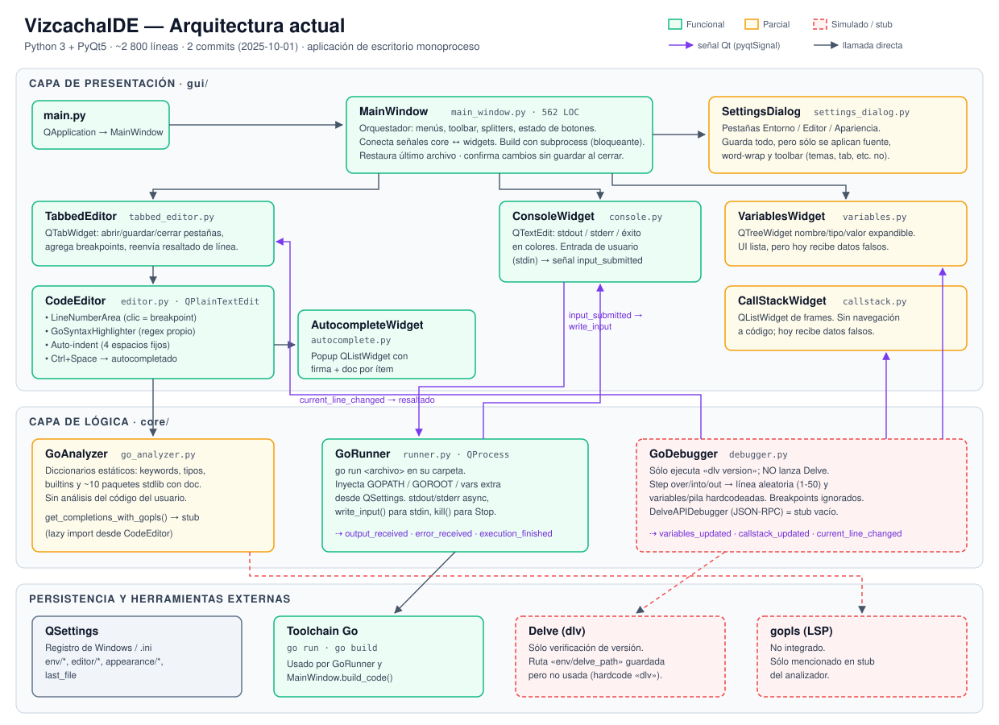

# VizcachaIDE — Current architecture

> State of the code as of commit `ba14318` (2025-10-01). This document was generated on 2026-09-30 by reading the source code, not the README.



## 1. Summary

VizcachaIDE is a **Python 3 + PyQt5** desktop application meant to be a "Thonny for Go". It has ~2,800 lines in 12 modules, organized into two packages:

| Package | Responsibility | LOC |
|---|---|---|
| `gui/` | Qt widgets: main window, editor, console, debugging panels, settings dialog | ~2,140 |
| `core/` | `go run` execution, debugger, analyzer for autocompletion | ~620 |

There are no tests, no packaging (PyInstaller is planned in the code but there is no `.spec`), no CI and no internationalization. All UI text is in English.

## 2. File structure

```
VizcachaIDE/
├── main.py                 # Creates QApplication and MainWindow
├── requirements.txt        # PyQt5, Pygments (Pygments is unused)
├── logo.png / logo.ico
├── hola.go                 # loose test file
├── examples/               # 6 sample Go programs
├── core/
│   ├── runner.py           # GoRunner  – go run via QProcess
│   ├── debugger.py         # GoDebugger – SIMULATED; DelveAPIDebugger – stub
│   └── go_analyzer.py      # GoAnalyzer – autocompletion with static dictionaries
└── gui/
    ├── main_window.py      # MainWindow – orchestrator
    ├── tabbed_editor.py    # TabbedEditor – tabs and files
    ├── editor.py           # CodeEditor, LineNumberArea, GoSyntaxHighlighter
    ├── autocomplete.py     # AutocompleteWidget + paint delegate
    ├── console.py          # ConsoleWidget – output and stdin
    ├── variables.py        # VariablesWidget – variables tree
    ├── callstack.py        # CallStackWidget – list of frames
    └── settings_dialog.py  # SettingsDialog – 3 settings tabs
```

## 3. Components

### 3.1 Presentation (`gui/`)

| Component | Qt base | What it does | Status |
|---|---|---|---|
| `MainWindow` | `QMainWindow` | Builds the layout (editor + right panel on top, console at the bottom, with `QSplitter`), the *File / Edit / Run / Debug / Help* menus and the toolbar, enables/disables actions, wires up signals. Contains `build_code()`, which calls `go build` with `subprocess.run` **on the UI thread**. | Working |
| `TabbedEditor` | `QTabWidget` | Open/save/close tabs, `*` modified marker, collects breakpoints, forwards current-line highlighting. | Working |
| `CodeEditor` | `QPlainTextEdit` | Line numbers with click-to-toggle breakpoints, custom regex-based syntax highlighting (`GoSyntaxHighlighter`), auto-indent (fixed 4 spaces, also after `:`), Ctrl+Space to autocomplete, yellow current-line highlight. | Working |
| `AutocompleteWidget` | `QListWidget` | Popup with name, signature and documentation; keyboard navigation. | Working |
| `ConsoleWidget` | `QTextEdit` | Colored output (stdout/stderr/success) and user input for `stdin`, emitting `input_submitted`. | Working |
| `VariablesWidget` | `QTreeWidget` | Name/type/value tree with expandable children. | UI ready, fake data |
| `CallStackWidget` | `QListWidget` | List of frames. No navigation to the code. | UI ready, fake data |
| `SettingsDialog` | `QDialog` | Environment / Editor / Appearance tabs, persisted in `QSettings`. | Partial (see §5) |

### 3.2 Logic (`core/`)

| Component | What it does | Status |
|---|---|---|
| `GoRunner` | Launches `go run <file>` with `QProcess` in the file's folder; injects `GOPATH`, `GOROOT` and extra variables; reads stdout/stderr asynchronously; `write_input()` feeds stdin; `stop()` calls `kill()`. | Working |
| `GoDebugger` | Checks that `dlv version` responds and **nothing else**: it does not start Delve. `step_over/into/out` emit a **random line between 1 and 50**, with **hardcoded** variables and stack. It ignores breakpoints. | **Simulated** |
| `DelveAPIDebugger` | Skeleton for headless Delve + JSON-RPC (`--listen=127.0.0.1:2345`). Empty methods; falls back to `GoDebugger`. | **Stub** |
| `GoAnalyzer` | Autocompletion with static lists: keywords, types, builtins and ~10 stdlib packages (`fmt`, `strings`, `os`, `math`…) with short documentation. Detects the `package.` context. It knows nothing about the user's own symbols. `get_completions_with_gopls()` is a stub. | Partial |

### 3.3 Persistence and external dependencies

- **`QSettings`** (Windows registry / `.ini`): keys `env/*`, `editor/*`, `appearance/*`, `last_file`.
- **Go toolchain**: `go run` (GoRunner) and `go build` (MainWindow).
- **Delve**: only its existence is checked.
- **gopls**: not used.

## 4. Main flows

### Run (F5)
1. `MainWindow.run_code()` requires the file to be saved, clears the console and disables *Run*.
2. `GoRunner.run()` creates a `QProcess` → `go run file.go`.
3. `readyReadStandardOutput/Error` → `output_received` / `error_received` signals → `ConsoleWidget`.
4. The user types in the console → `input_submitted` → `GoRunner.write_input()` → stdin.
5. `finished` → `execution_finished(code)` → `MainWindow.on_execution_finished()` re-enables the buttons.

### Debug (F6)
1. `MainWindow.start_debug()` collects breakpoints from all tabs and calls `GoDebugger.start()`.
2. `dlv version` is executed (blocking, 5 s timeout).
3. A `QTimer` emits line 1 and a placeholder variable.
4. Each *Step* emits a random line plus sample data. **The user's program is never executed.**

### Autocomplete (Ctrl+Space)
`CodeEditor` lazily imports `GoAnalyzer` and `AutocompleteWidget` → `get_completions(text, cursor)` → top 20 → popup → `insert_completion()` replaces the prefix.

### Communication between layers
All core → UI coupling goes through **Qt signals** wired up in `MainWindow.connect_signals()`. This is a clean pattern and worth keeping when the debugger is replaced.

## 5. Gaps between the README / settings and the code

| What is advertised | Reality in the code |
|---|---|
| Step-by-step debugging with Delve | Simulated (random lines, fixed data) |
| Breakpoints | Drawn and collected, but the debugger ignores them |
| Light/Dark/Solarized themes, console theme, custom colors | Saved in `QSettings`, never applied |
| Tab size, auto-indent on/off, show line numbers, status bar | Saved, never read outside the dialog |
| Configurable Delve path | Saved; the debugger uses a hardcoded `dlv` |
| Highlighting with Pygments | Pygments is in `requirements.txt` but is never imported |
| Recent files list | Only the last file is remembered |
| Brace matching and *code folding* | Not implemented in `editor.py` |
| `go build` honors the configured environment variables | No: `build_code()` does not inject GOPATH/GOROOT/extras and blocks the UI |

## 6. Technical observations

- **Single process, no threads**: fine for `go run` (QProcess is asynchronous), but `build_code()` and the `dlv` check freeze the UI.
- **Imports inside functions** (`import os` in several methods) and environment logic duplicated between `GoRunner` and `build_code()`; a shared `GoEnvironment` is advisable.
- **Single file**: `go run file.go` does not support multi-file packages or the project's `go.mod`.
- **PyQt5** is in maintenance mode; migrating to **PySide6/PyQt6** is reasonable before growing.
- **No tests** and no model/view separation for the debugger, which makes it hard to replace the simulator.
- The `.kilo/worktrees/` folder (untracked) contains a copy of the code; it is not part of the architecture.

## 7. Suggested next steps (by impact)

1. **Real debugger**: `dlv debug --headless --api-version=2 --listen=127.0.0.1:<port>` + a JSON-RPC client (or DAP: `dlv dap`) in a `QThread`/`QTcpSocket`, reusing the existing signals.
2. **gopls via LSP** for autocompletion, live diagnostics, go to definition and hover.
3. **Apply the settings that are already saved** (themes, tab, line numbers, Delve path) — low effort, high visible impact.
4. Unify the Go environment and move `go build` to `QProcess`.
5. `gofmt` on save and `go vet` as a checker.
6. **English/Spanish internationalization** (interface, errors, help, installer), because the project will be published worldwide.

The detailed plan, with the target architecture and the tracks for parallel agents, is in [DEVELOPMENT_PLAN.md](DEVELOPMENT_PLAN.md) ([diagram](arquitectura-objetivo.svg)).

See the feature comparison against Thonny in [THONNY_COMPARISON.md](THONNY_COMPARISON.md).
