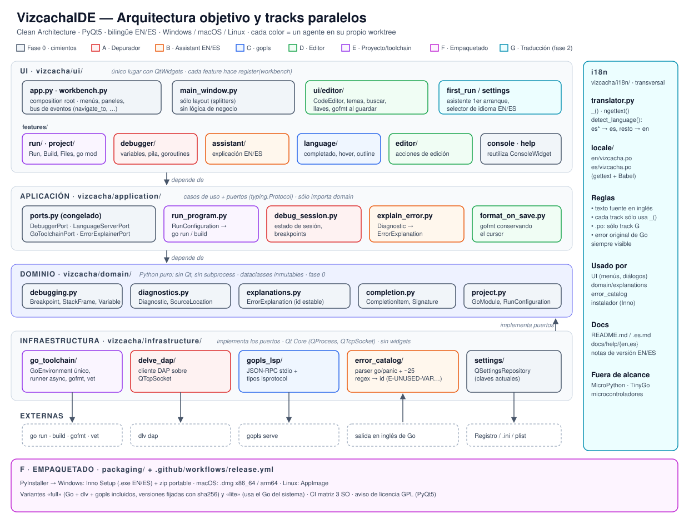

# VizcachaIDE — Plan de desarrollo paralelo

> Objetivo: pasar del prototipo actual ([ARQUITECTURA.md](ARQUITECTURA.md)) a una **versión 1.0 pública, bilingüe (inglés/español) y con instaladores para Windows, macOS y Linux**. Se cubren las brechas P0/P1 de [COMPARATIVA_THONNY.md](COMPARATIVA_THONNY.md).
>
> El trabajo se divide en **tracks independientes** que agentes de IA (o personas) pueden desarrollar en paralelo, cada uno en su propio *git worktree*.



## 0. Decisiones tomadas

| Tema | Decisión |
|---|---|
| Binding Qt | **PyQt5** (se mantiene). Ver riesgo de licencia en §8 |
| Plataformas | Windows, macOS (Intel + Apple Silicon) y Linux |
| Idiomas | **Inglés y español** en la interfaz, los mensajes, las explicaciones de errores y la documentación |
| Selección de idioma | Automática según el sistema (`es*` → español, cualquier otro → inglés). Se puede cambiar en el primer arranque y en Configuración |
| Fuera de alcance | **MicroPython, TinyGo y microcontroladores en general** |
| Estilo de arquitectura | Clean Architecture + DDD, library-first |

## 1. Arquitectura objetivo

```
vizcacha/
├── domain/                 # Python puro. Prohibido importar Qt o subprocess.
│   ├── debugging.py        # Breakpoint, StackFrame, Variable, Goroutine, DebugState
│   ├── diagnostics.py      # Diagnostic, Severity, SourceLocation
│   ├── explanations.py     # ErrorExplanation (ids estables, textos traducibles)
│   ├── completion.py       # CompletionItem, SignatureHelp
│   └── project.py          # GoModule, RunConfiguration
├── application/            # Casos de uso + puertos. Sólo importa domain.
│   ├── ports.py            # Contratos (typing.Protocol), congelados en la fase 0
│   ├── run_program.py
│   ├── debug_session.py
│   ├── explain_error.py
│   └── format_on_save.py
├── infrastructure/         # Adaptadores concretos que implementan los puertos.
│   ├── go_toolchain/       # GoEnvironment, GoProcessRunner (QProcess), GoFormatter
│   ├── delve_dap/          # DelveDapDebugger: cliente DAP sobre QTcpSocket
│   ├── gopls_lsp/          # GoplsLanguageServer: JSON-RPC sobre QProcess + lsprotocol
│   ├── error_catalog/      # GoOutputParser + ErrorCatalog (regex → ErrorExplanation)
│   └── settings/           # QSettingsRepository (mantiene las claves actuales)
├── i18n/
│   ├── translator.py       # install_language(), _() y ngettext()
│   ├── babel.cfg
│   └── locale/{en,es}/LC_MESSAGES/vizcacha.po
├── ui/                     # Todo lo que es Qt.
│   ├── app.py              # Composition root: crea adaptadores y los inyecta
│   ├── workbench.py        # Workbench: registro de acciones, menús, vistas y paneles
│   ├── main_window.py      # Sólo layout + Workbench (sin lógica)
│   ├── editor/             # CodeEditor, LineNumberArea, GoSyntaxHighlighter
│   └── features/           # Cada feature es un plugin interno con register(workbench)
│       ├── run/  debugger/  assistant/  language/  editor/  project/
└── main.py
```

**Reglas de dependencia** (las comprueba un test de arquitectura en CI):

- `domain` → no importa nada del proyecto ni de Qt.
- `application` → sólo `domain`.
- `infrastructure` → `domain`, `application.ports` y Qt *Core* (QProcess/QTcpSocket); nunca widgets.
- `ui` → todo lo anterior. Es el único lugar con `QtWidgets`.
- `ui/app.py` es el único sitio que instancia adaptadores concretos (composition root).

**Reglas de código** (skill *software-architecture*):

- Archivos de menos de 200 líneas y funciones de menos de 50; anidamiento máximo de 3; *early return*.
- Nombres de dominio. Prohibidos `utils.py`, `helpers.py` y `common.py`.
- Excepciones tipadas (`GoToolchainNotFound`, `DebugAdapterError`…), nunca `except Exception:` mudo.
- Library-first: antes de escribir infraestructura propia, buscar un paquete mantenido.

### 1.1 Contratos (`application/ports.py`), congelados en la fase 0

```python
class DebuggerPort(Protocol):
    def start(self, config: RunConfiguration, breakpoints: list[Breakpoint]) -> None: ...
    def set_breakpoints(self, file: Path, lines: list[int]) -> None: ...
    def step_over(self) -> None: ...
    def step_into(self) -> None: ...
    def step_out(self) -> None: ...
    def resume(self) -> None: ...
    def run_to(self, location: SourceLocation) -> None: ...
    def variables(self, frame_id: int, reference: int = 0) -> list[Variable]: ...
    def stop(self) -> None: ...
    # Eventos (señales Qt en el adaptador): stopped(DebugState), output(str, stream), terminated(int)

class LanguageServerPort(Protocol):
    def open_document(self, path: Path, text: str) -> None: ...
    def change_document(self, path: Path, text: str, version: int) -> None: ...
    def completion(self, loc: SourceLocation) -> list[CompletionItem]: ...
    def hover(self, loc: SourceLocation) -> str | None: ...
    def definition(self, loc: SourceLocation) -> SourceLocation | None: ...
    def signature_help(self, loc: SourceLocation) -> SignatureHelp | None: ...
    # Evento: diagnostics_published(Path, list[Diagnostic])

class GoToolchainPort(Protocol):
    def environment(self) -> Mapping[str, str]: ...
    def run(self, config: RunConfiguration) -> None: ...      # async; eventos output/finished
    def build(self, config: RunConfiguration) -> None: ...
    def format_source(self, text: str) -> str: ...             # gofmt; lanza GoFormatError
    def vet(self, config: RunConfiguration) -> list[Diagnostic]: ...

class ErrorExplainerPort(Protocol):
    def parse(self, raw_output: str, workdir: Path) -> list[Diagnostic]: ...
    def explain(self, diagnostic: Diagnostic) -> ErrorExplanation | None: ...

class SettingsRepository(Protocol):
    def get(self, key: str, default: T) -> T: ...
    def set(self, key: str, value: object) -> None: ...
```

## 2. Decisiones *library-first*

| Necesidad | Solución | Justificación |
|---|---|---|
| Depurador | **`dlv dap`** (Delve con Debug Adapter Protocol) | Es el protocolo estándar (lo usa VS Code) y Delve lo trae de serie. Más estable que la API JSON-RPC v2 |
| Cliente DAP | Implementación propia mínima (~150 LOC) sobre `QTcpSocket` | No existe un cliente DAP maduro en Python; el framing (`Content-Length` + JSON) es trivial |
| LSP | **gopls** + tipos de **`lsprotocol`** | Tipos oficiales de Microsoft; transporte JSON-RPC sobre stdio con QProcess |
| i18n | **gettext + Babel** (`pybabel extract/init/update/compile`) | Funciona en `domain`, que no tiene Qt (ahí viven los textos de error). Los `.po` son el estándar que entienden Weblate, POEditor y Crowdin |
| Formateo | `gofmt` (y `goimports` si está disponible) | — |
| Análisis estático | `go vet` (+ `staticcheck` opcional) | — |
| Tests | `pytest`, `pytest-qt` | — |
| Lint/format Python | `ruff` | — |
| Test de arquitectura | `import-linter` | Hace cumplir las reglas de dependencia entre capas |
| Empaquetado | PyInstaller + Inno Setup (Windows), `create-dmg` (macOS), `appimagetool` (Linux) | — |
| CI/CD | GitHub Actions con matriz `windows-latest`, `macos-14`, `macos-13`, `ubuntu-22.04` | — |

## 3. Internacionalización EN/ES (transversal)

### 3.1 Interfaz
- Todo texto visible se escribe **en inglés como clave** y pasa por `_()`: `_("Run")`, `_("Step over")`.
- `i18n/translator.py`:
  - `install_language(code)` carga el catálogo `vizcacha` con `gettext.translation(..., fallback=True)`.
  - `detect_language()` toma la clave `general/language` de `QSettings` o, si no existe, `QLocale.system().name()`: `es*` → `es`, cualquier otro → `en`.
  - Cambiar el idioma pide reiniciar. Es más simple y robusto que retraducir en caliente.
- Plurales con `ngettext`. Fechas y números con `QLocale`.
- Los atajos de teclado no se traducen.

### 3.2 Errores del compilador y en tiempo de ejecución
Go emite sus errores **siempre en inglés**. VizcachaIDE añade una capa explicativa bilingüe:

```
salida cruda de go ──► GoOutputParser ──► Diagnostic(file, line, col, raw_text)
                                              │
                                ErrorCatalog (regex → id estable)
                                              │
                    ErrorExplanation(id="E-UNUSED-VAR",
                                     title=_("Variable declared but never used"),
                                     body=_("Go does not allow unused variables… {name}"),
                                     fix_hint=_("Use the variable or delete it, or assign it to _"))
```

- **Siempre** se muestra también el mensaje original, sin traducir, para poder buscarlo en la web.
- Ids estables (`E-UNUSED-VAR`, `E-UNUSED-IMPORT`, `E-MISSING-RETURN`, `E-UNDEFINED`, `E-TYPE-MISMATCH`, `E-NO-MAIN`, `P-INDEX-RANGE`, `P-NIL-MAP`, `P-NIL-POINTER`, `P-DEADLOCK`, …). Los ids sirven para enlazar a la ayuda y para tests.
- Catálogo inicial: **~25 errores**, los más frecuentes en principiantes.
- Cuando un error no está en el catálogo, se muestra el texto original con un enlace "Search this error" / "Buscar este error".

### 3.3 Documentación y release
- `README.md` en inglés y `README.es.md` en español, con enlaces cruzados.
- Notas de versión en EN y ES.
- Ayuda integrada (`ui/features/help`) en `docs/help/{en,es}/*.md`.

### 3.4 Regla para el trabajo en paralelo
Cada track **sólo envuelve sus strings con `_()`** y no toca los `.po`. El track G (fase 2) ejecuta `pybabel extract/update` y traduce todo. Así se evitan conflictos de merge en los catálogos.

## 4. Fases

```
Fase 0 (1 agente) ──► Fase 1 (6 agentes en paralelo) ──► Fase 2 (3 agentes en paralelo) ──► Fase 3 (release)
cimientos              A B C D E F                         G H I                             QA + publicación
```

### Fase 0: cimientos (secuencial, bloqueante)

**Objetivo**: preparar el terreno para que 6 agentes trabajen sin pisarse.

1. Mover `core/` y `gui/` a `vizcacha/` según §1, **sin cambiar el comportamiento** visible.
2. Crear `domain/*.py` y `application/ports.py` con los contratos de §1.1.
3. Crear `ui/workbench.py`, que expone:
   - `add_action(menu, action, toolbar=False)`;
   - `add_panel(id, widget, area)`;
   - `add_status_widget(widget)`;
   - `events` (bus de señales: `file_opened`, `file_saved`, `run_requested`, `diagnostics_changed`, `navigate_to(SourceLocation)`).

   Las features se registran con `register(workbench, services)`. `main_window.py` queda reducido a layout.
4. Crear `ui/app.py` como composition root.
5. Crear `i18n/translator.py` + `babel.cfg` y envolver los strings existentes con `_()`, sin traducirlos todavía.
6. **Eliminar el depurador simulado** (`_simulate_step`) y dejar un `NullDebugger` que avisa "Debugger not available yet".
7. Implementación mínima de `GoEnvironment` para unificar la lógica duplicada de [core/runner.py](../core/runner.py) y `build_code()` en [gui/main_window.py](../gui/main_window.py).
8. Configurar `pyproject.toml` (dependencias, ruff, pytest, import-linter), `tests/` con smoke tests y `.github/workflows/ci.yml` con la matriz de 3 SO.
9. Quitar `Pygments` de las dependencias, porque no se usa.

**Terminado cuando**: `python -m vizcacha` abre la app y Run funciona igual que hoy; CI está en verde en los 3 SO; `import-linter` pasa; los contratos están documentados.

### Fase 1: seis tracks en paralelo

| Track | Posee (sólo puede editar esto) | Entrega |
|---|---|---|
| **A · Depurador Delve** | `infrastructure/delve_dap/`, `application/debug_session.py`, `ui/features/debugger/`, `tests/debugger/` | Depuración real: breakpoints, pasos, resume, run to cursor, variables, stack, goroutines |
| **B · Assistant EN/ES** | `infrastructure/error_catalog/`, `application/explain_error.py`, `ui/features/assistant/`, `tests/assistant/` | Parser + catálogo de ~25 errores + panel Assistant + enlaces clicables |
| **C · gopls** | `infrastructure/gopls_lsp/`, `ui/features/language/`, `tests/language/` | Autocompletado real, diagnósticos en vivo, hover, ir a definición, call-tips, outline |
| **D · Editor** | `ui/editor/`, `ui/features/editor/`, `tests/editor/` | gofmt al guardar, tabs, buscar/reemplazar, ir a línea, llaves, comentar bloque, archivos recientes, recarga, zoom, temas aplicados |
| **E · Proyecto y toolchain** | `infrastructure/go_toolchain/`, `application/run_program.py`, `ui/features/run/`, `ui/features/project/`, `tests/toolchain/` | Proyectos `go.mod`, `go run .`, argumentos del programa, build asíncrono, "Untitled", vista Files, `go mod` gráfico |
| **F · Empaquetado** | `packaging/`, `.github/workflows/release.yml` | Instaladores para los 3 SO, con y sin Go incluido |

Archivos **compartidos de sólo lectura** para todos los tracks: `domain/`, `application/ports.py`, `ui/workbench.py` y `ui/app.py`. Si un track necesita cambiar un contrato, **no lo edita**: lo describe en su PR como "Contract change request" y lo resuelve el integrador.

La única excepción es `ui/app.py`: cada track puede añadir **una línea** de registro de su feature. El orden de merge resuelve el conflicto trivial.

**Orden de merge**: E → A → C → B → D → F. Tras cada merge se ejecuta el CI completo y se rebasan los worktrees restantes.

### Fase 2: integración y segunda ola (paralelo)

| Track | Entrega |
|---|---|
| **G · Traducción e i18n** | `pybabel extract/update`, traducción **completa** al español, revisión del inglés, selector de idioma en Configuración, **asistente de primer arranque** (idioma, tema, detección de Go/dlv/gopls con botón "Instalar"), `README.es.md`, ayuda en `docs/help/{en,es}` |
| **H · Didáctica** | Frames como ventanas anidadas (recursión visible), visualizador de memoria (punteros, `len`/`cap`, slices que comparten array), modos de interfaz simple/regular/experto |
| **I · Extras** | Panel de `go test`, colores ANSI y `\r` en la consola, REPL experimental con **yaegi** |

### Fase 3: release 1.0
- QA manual en Windows, macOS y Linux con `examples/`, más ejemplos nuevos de errores típicos (uno por cada id del catálogo).
- Firma de código (Authenticode en Windows; notarización en macOS si hay cuenta de Apple Developer).
- GitHub Release con instaladores, notas EN/ES y capturas en los dos idiomas.

## 5. Prompts de agente (listos para copiar)

Todos los agentes se lanzan con `isolation: "worktree"` sobre la rama resultante de la fase 0. Cada prompt empieza con este **bloque común**:

```text
CONTEXTO COMÚN
Proyecto: VizcachaIDE, un IDE para principiantes en Go inspirado en Thonny. Python 3.10+ y PyQt5.
Lee docs/PLAN_DESARROLLO.md (§1 arquitectura, §1.1 contratos, §3 i18n) antes de empezar.
Reglas:
- Edita SÓLO las carpetas que posee tu track. domain/, application/ports.py y ui/workbench.py son
  de sólo lectura. Si necesitas cambiar un contrato, descríbelo en tu informe final como
  "Contract change request" y no lo edites.
- En ui/app.py puedes añadir una única línea para registrar tu feature.
- Todo texto visible al usuario va dentro de _() / ngettext(), escrito en inglés. No edites los .po.
- Archivos de menos de 200 líneas, funciones de menos de 50, early return, nombres de dominio
  (prohibidos utils/helpers/common), excepciones tipadas.
- Prefiere librerías mantenidas antes que código propio.
- Fuera de alcance: MicroPython, TinyGo, microcontroladores.
Terminado cuando: tus tests en tests/<tu_track>/ pasan, `ruff check` y `lint-imports` están limpios,
la app arranca, y tu informe final incluye: archivos creados, cómo probarlo a mano en 3 pasos,
limitaciones conocidas y contract change requests (si hay).
```

### Track A · Depurador Delve
```text
Implementa DelveDapDebugger (infrastructure/delve_dap/), que cumple DebuggerPort, usando `dlv dap`.
- Lanza `dlv dap --listen=127.0.0.1:0` con QProcess. Lee el puerto de la salida y conéctate con QTcpSocket.
  Framing DAP: cabecera Content-Length + JSON.
- Secuencia: initialize → launch (mode "debug", program = carpeta o archivo de RunConfiguration,
  args, env de GoToolchainPort.environment()) → setBreakpoints → configurationDone.
- Mapea los eventos stopped/output/terminated a señales Qt. Ante stopped, pide threads, stackTrace y
  scopes/variables y emite un DebugState del dominio.
- Variables con expansión perezosa (variablesReference). Strings largos truncados.
- Operaciones: step_over=next, step_into=stepIn, step_out=stepOut, resume=continue,
  run_to = breakpoint temporal + continue.
- UI en ui/features/debugger/: reutiliza la lógica de los widgets de variables y de pila de ui/,
  añade una vista de goroutines y un clic en un frame que emita workbench.events.navigate_to.
  La salida del programa (stdout/stderr) va a la consola existente.
- Ruta de dlv: SettingsRepository "env/delve_path" o, si está vacía, el PATH. Si no existe, lanza
  DebugAdapterNotFound y muestra un mensaje traducible con la instrucción de instalación.
- Tests: framing y parsing DAP con transcripciones grabadas (sin dlv); un test de integración marcado
  @pytest.mark.requires_dlv que depure examples/functions.go.
```

### Track B · Assistant EN/ES
```text
Implementa la explicación de errores para principiantes.
- infrastructure/error_catalog/go_output_parser.py: convierte la salida cruda de go build/run/vet y los
  panics (incluido el goroutine trace) en list[Diagnostic] con file/line/col y raw_text.
  Soporta rutas relativas y absolutas, Windows y POSIX.
- infrastructure/error_catalog/catalog.py + entradas en módulos por categoría (compile_errors.py,
  runtime_panics.py, vet_warnings.py): regex → ErrorExplanation con id estable
  (E-UNUSED-VAR, E-UNUSED-IMPORT, E-MISSING-RETURN, E-UNDEFINED, E-TYPE-MISMATCH, E-NO-MAIN,
  E-PACKAGE-NOT-MAIN, E-SYNTAX-UNEXPECTED, E-MISSING-BRACE, E-ASSIGN-MISMATCH, E-NOT-ENOUGH-ARGS,
  E-TOO-MANY-ARGS, E-NO-NEW-VARS, E-UNEXPORTED, E-IMPORT-NOT-FOUND, P-INDEX-RANGE, P-NIL-MAP,
  P-NIL-POINTER, P-DEADLOCK, P-DIVIDE-ZERO, P-SLICE-BOUNDS, P-TYPE-ASSERTION, V-PRINTF-ARGS,
  V-UNREACHABLE, V-SHADOW…). title/body/fix_hint se escriben en inglés con _() y admiten
  placeholders con nombre ({name}, {type}).
- application/explain_error.py: caso de uso que recibe la salida o los diagnostics de gopls y
  devuelve pares (Diagnostic, ErrorExplanation | None).
- ui/features/assistant/: panel que se abre solo cuando hay error. Muestra título, explicación,
  sugerencia y el TEXTO ORIGINAL sin traducir, con un botón "Search this error". Además, convierte
  los `file.go:12:5` de la consola en enlaces que emiten workbench.events.navigate_to.
- Crea examples/errors/<id>.go con un programa mínimo que provoque cada error.
- Tests: cada ejemplo de examples/errors produce exactamente el id esperado (salida grabada en
  fixtures, sin requerir go); parser con rutas Windows y POSIX.
```

### Track C · gopls
```text
Implementa GoplsLanguageServer (infrastructure/gopls_lsp/), que cumple LanguageServerPort.
- QProcess `gopls serve` por stdio. JSON-RPC con Content-Length. Usa los tipos de `lsprotocol`
  y cattrs para (de)serializar.
- initialize con rootUri del proyecto (o la carpeta del archivo), didOpen/didChange (con debounce
  de 300 ms), completion, hover, definition, signatureHelp, documentHighlight, documentSymbol, y la
  notificación publishDiagnostics → señal diagnostics_published.
- ui/features/language/: reemplaza el autocompletado estático (conserva GoAnalyzer como fallback
  si gopls no está). Subrayado ondulado de diagnostics, tooltip de hover, Ctrl+clic para ir a
  definición, call-tip al escribir "(", resaltado de apariciones, panel Outline.
- Los diagnostics se publican también en workbench.events.diagnostics_changed para que el
  Assistant (track B) los consuma.
- Si gopls no existe: degradación silenciosa al fallback y aviso único traducible en la barra de estado.
- Tests: framing y mapeo de mensajes con transcripciones grabadas; integración con
  @pytest.mark.requires_gopls.
```

### Track D · Editor
```text
Mejora el editor (ui/editor/ y ui/features/editor/).
- Aplica TODAS las opciones que hoy se guardan y se ignoran: editor_theme (Light, Dark, Solarized
  Light/Dark: definir los temas como datos, con colores de sintaxis y de editor), console_theme,
  tab_size, auto_indent, show_line_numbers, show_status_bar, background_color/text_color.
  Mantén las claves de QSettings existentes.
- Indentación con TAB real (idiomático en Go) y ancho visual = tab_size. Quita el "indent tras :".
- gofmt al guardar, a través de GoToolchainPort.format_source. Conserva la posición del cursor.
  Si falla, no bloquea el guardado y deja el error en la barra de estado.
- Buscar/Reemplazar no modal (Ctrl+F / Ctrl+H, F3), Ir a línea (Ctrl+G), emparejado de llaves,
  comentar/descomentar (Ctrl+/), indentar o desindentar la selección, zoom (Ctrl+= / Ctrl+-).
- Archivos recientes (máximo 10) en el menú File. QFileSystemWatcher que recarga o pregunta si el
  archivo cambió fuera del IDE.
- Respuesta a workbench.events.navigate_to: abrir el archivo y mover el cursor.
- Tests con pytest-qt para buscar/reemplazar, comentar, emparejado y aplicación de temas.
```

### Track E · Proyecto y toolchain
```text
Implementa GoToolchainPort (infrastructure/go_toolchain/) y la experiencia de proyecto.
- GoEnvironment: único lugar que resuelve go_path, GOPATH, GOROOT y las variables extra
  (claves env/* actuales) y localiza go, dlv y gopls (configurado → bundle junto al ejecutable → PATH).
- GoProcessRunner con QProcess para run y build, ambos ASÍNCRONOS (hoy build bloquea la UI). Stop
  envía primero una interrupción y mata al proceso tras 2 s.
- RunConfiguration: archivo suelto (`go run file.go`) o módulo (carpeta con go.mod → `go run .`),
  con argumentos del programa (campo "Program arguments" en la barra de herramientas).
- Ejecutar pestañas "Untitled" escribiéndolas en un directorio temporal.
- format_source (gofmt por stdin) y vet (go vet -json → Diagnostic).
- ui/features/run/: acciones Run, Stop y Build con atajos F5, Shift+F5 y Ctrl+B.
- ui/features/project/: "Open folder…", vista Files (QFileSystemModel filtrado), diálogo de módulos:
  go mod init, go get <pkg>[@version], go mod tidy, con salida en la consola.
- Tests: construcción de comandos y entorno con un GoEnvironment simulado; integración
  @pytest.mark.requires_go que ejecuta examples/hello.go.
```

### Track F · Empaquetado
```text
Crea la distribución multiplataforma (packaging/ y .github/workflows/release.yml).
- packaging/fetch_toolchain.py: descarga versiones fijadas (archivo packaging/versions.toml) de Go,
  y compila o descarga dlv y gopls para el SO y arquitectura destino, verificando el sha256.
- PyInstaller (packaging/vizcacha.spec): incluye vizcacha/i18n/locale/*.mo, logo y examples.
  Variante "full" (con toolchain en ./toolchain) y "lite" (usa el Go del sistema).
- Windows: Inno Setup (instalador por usuario, accesos directos, asociación .go opcional) + zip
  portable. macOS: .app + create-dmg, builds x86_64 y arm64 (verificar wheels de PyQt5 en arm64;
  si no hay, sólo x86_64 vía Rosetta y documentarlo). Linux: AppImage.
- El instalador ofrece idioma EN/ES (Inno Setup lo soporta de forma nativa).
- release.yml: al hacer push de un tag v*, compila en la matriz de SO, sube artefactos y crea un
  GitHub Release en borrador.
- Documenta en packaging/README.md el aviso de licencia: PyQt5 es GPL, así que el binario
  distribuido queda bajo GPLv3. Debe aparecer en el instalador y en "About".
```

## 6. Integración (tú o un agente integrador)

Tras cada merge de la fase 1:
1. `git rebase` de los worktrees pendientes sobre `main`.
2. CI completo (3 SO) + `lint-imports`.
3. Resolver los *contract change requests* (sólo el integrador edita `ports.py` y `domain/`).
4. Prueba manual de humo: abrir `examples/functions.go` → Run → Debug con un breakpoint → provocar un error de `examples/errors/` → ver el Assistant.

## 7. Matriz de cobertura vs Thonny

| Brecha P0/P1 (COMPARATIVA_THONNY.md) | Track |
|---|---|
| Depurador real, breakpoints, variables, pila | A |
| Goroutines | A |
| Assistant y errores clicables (EN/ES) | B |
| Autocompletado inteligente, diagnósticos en vivo, call-tips, ir a definición | C |
| gofmt, buscar/reemplazar, temas aplicados | D |
| Proyectos go.mod, argumentos del programa, build asíncrono, vista Files, gestor de módulos | E |
| Instalador con Go incluido | F |
| Interfaz EN/ES, primer arranque | Base en la fase 0, traducción en G |
| Frames anidados, visualizador de memoria, modos de interfaz | H |
| REPL, go test | I |

## 8. Riesgos y mitigaciones

| Riesgo | Mitigación |
|---|---|
| **PyQt5 es GPL** y el repositorio es MIT: el binario distribuido queda bajo GPL | Documentarlo en el README, el instalador y "About". La capa `ui/` aislada permite migrar a PySide6 (LGPL) más adelante con cambios acotados |
| PyQt5 sin wheels arm64 para macOS | Verificarlo en CI en el track F; si no hay, generar sólo build x86_64 (Rosetta 2) |
| Instalador "full" pesado (~250–300 MB con Go) | Ofrecer también la variante "lite" |
| Cambios de protocolo en dlv/gopls | Versiones fijadas en `packaging/versions.toml` + tests con transcripciones grabadas |
| Conflictos entre agentes | Carpetas disjuntas, contratos congelados, `.po` sólo en el track G, orden de merge fijo |
| Traducciones de mala calidad | Revisión humana del `.po` español antes del release; glosario de términos (breakpoint = "punto de interrupción", slice = "slice") en `docs/i18n-glosario.md` |
